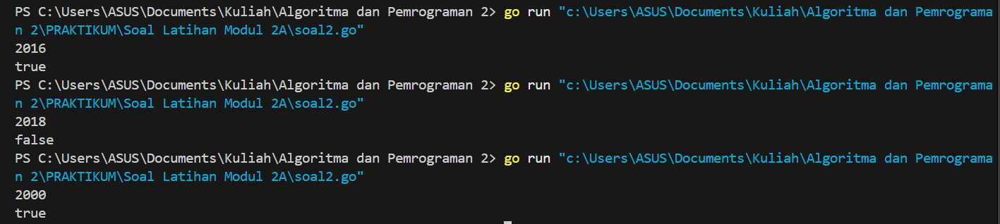
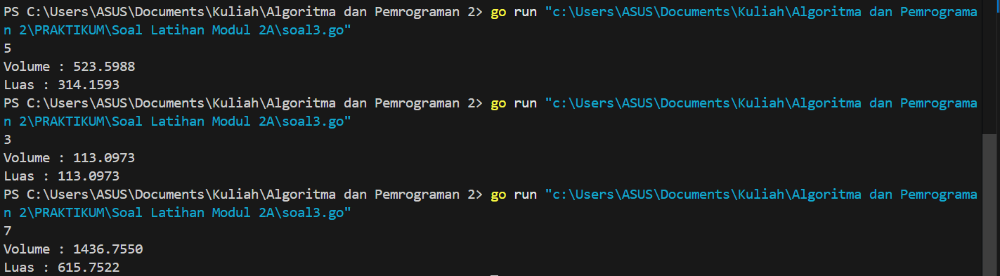
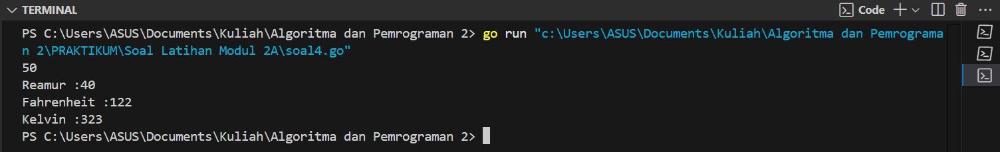
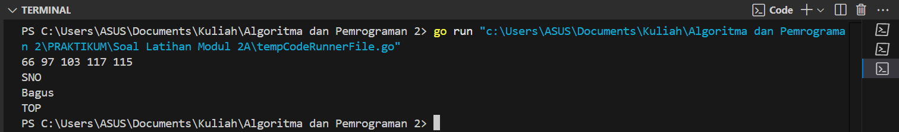
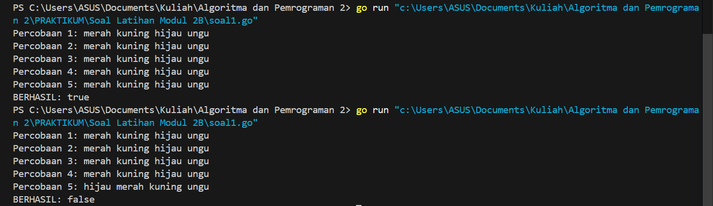
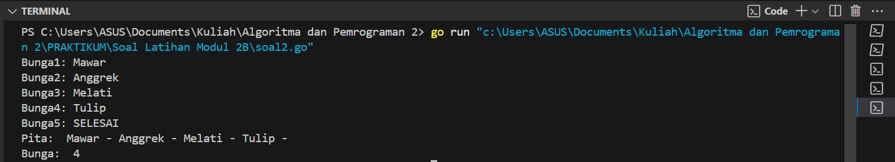
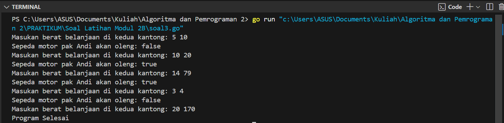
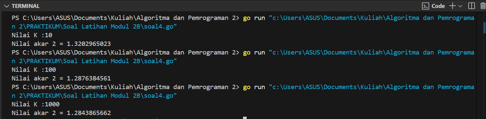
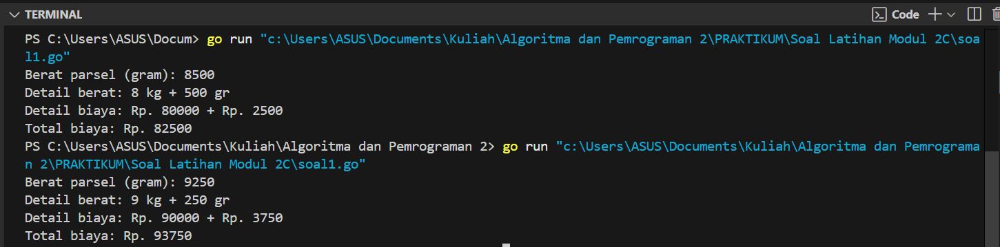
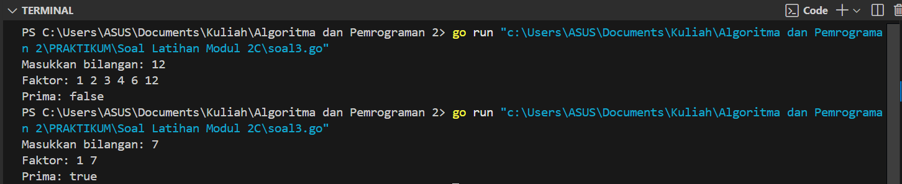

---
<h1 align="center">Laporan Praktikum Modul2 - Review Struktur Kontrol</h1>

<p align="center">Tri Setyono Martyantoro - 103112400279</p>
<p align="center">S1IF - 12 - 05</p>

---
## Soal Latihan Modul 2A


---


> 1. Telusuri program berikut dengan cara mengkompilasi dan mengeksekusi program. Silakan masukan data yang sesuai sebanyak yang diminta program. Perhatikan keluaran yang diperoleh. Coba terangkan apa sebenarnya yang dilakukan program tersebut?

```go
package main

import “fmt”

func main() {
    var (
        satu, dua, tiga string
        temp string
    )
    fmt.Print("Masukan input string: ")
    fmt.Scanln(&satu)
    fmt.Print("Masukan input string: ")
    fmt.Scanln(&dua)
    fmt.Print("Masukan input string: ")
    fmt.Scanln(&tiga)
    fmt.Println("Output awal = " + satu + " " + dua + " " + tiga)
    temp = satu
    satu = dua
    dua = tiga
    tiga = temp
    fmt.Println("Output akhir = " + satu + " " + dua + " " + tiga)
}
```
Program di atas adalah program  untuk menukar posisi tiga string yang dimasukkan oleh pengguna. Algoritmanya dimulai dengan mendeklarasikan empat variabel bertipe string, yaitu `satu`, `dua`, `tiga`, dan `temp`. Program kemudian meminta pengguna untuk memasukkan tiga string secara berurutan dan menyimpannya dalam variabel `satu`, `dua`, dan `tiga`. Setelah itu, program menampilkan urutan awal dari tiga string yang dimasukkan. Selanjutnya, program melakukan pertukaran nilai dengan menyimpan nilai `satu` ke dalam variabel `temp`, kemudian menggeser nilai `dua` ke `satu`, nilai `tiga` ke `dua`, dan terakhir mengisi nilai `tiga` dengan nilai dari `temp`. Setelah pertukaran selesai, program menampilkan urutan akhir dari tiga string yang telah ditukar posisinya.

---

>  2. Tahun kabisat adalah tahun yang habis dibagi 400 atau habis dibagi 4 tetapi tidak habis dibagi 100. Buatlah sebuah program yang menerima input sebuah bilangan bulat dan memeriksa apakah bilangan tersebut merupakan tahun kabisat (true) atau bukan (false). (Contoh input/output, Teks bergaris bawah adalah input dari user):

```go
package main
import "fmt"

func main() {
	var tahun int
    var kabisat bool

    fmt.Scan(&tahun)
    kabisat = tahun%400 == 0 || (tahun%4 == 0 && tahun%100 != 0)
    fmt.Println(kabisat)
}
```
### Output Code

Program di atas adalah program yang digunakan untuk menentukan apakah suatu tahun merupakan tahun kabisat atau bukan. Algoritmanya dimulai dengan mendeklarasikan dua variabel, yaitu `tahun` yang bertipe integer dan `kabisat` yang bertipe boolean, kemudian program meminta pengguna untuk memasukkan sebuah angka yang mewakili tahun, kemudian Program  menggunakan rumus logika untuk menentukan apakah tahun tersebut merupakan tahun kabisat. Suatu tahun dikatakan kabisat jika memenuhi salah satu dari dua kondisi berikut apakah tahun tersebut habis dibagi 400 atau tahun tersebut habis dibagi 4 tetapi tidak habis dibagi 100.
Jika salah satu dari kondisi tersebut terpenuhi, maka tahun tersebut dianggap sebagai tahun kabisat.

---

> 3. Buat program Bola yang menerima input jari-jari suatu bola (bilangan bulat). Tampilkan Volume dan Luas kulit bola. 𝑣𝑜𝑙𝑢𝑚𝑒𝑏𝑜𝑙𝑎= 𝜋𝑟 dan 𝑙𝑢𝑎𝑠𝑏𝑜𝑙𝑎=4𝜋𝑟 (π ≈ 3.1415926535). (Contoh input/output, Teks bergaris bawah adalah input dari user):

```go
package main
import "fmt"

func main() {
    var r float64
    var volume, luas float64
    const phi = 3.1415926535

    fmt.Scan(&r)
    volume = (4.0 / 3.0 ) * phi * r * r * r
    luas = 4.0 * phi * r * r

    fmt.Printf("Volume : %.4f\n", volume)
    fmt.Printf("Luas : %.4f\n", luas)
}
```
### Output Code

Program diatas adalah program yang digunakan untuk menghitung volume dan luas bola berdasarkan jari jari yang diinputkan oleh pengguna. Algoritmanya dimulai dengan mendeklarasikan variabel r, volume dan luas bertipe float64 dan konstanta phi dengan nilai 3.1415926535 untuk digunakan dalam perhitungan, kemudian program meminta pengguna untuk memasukan jari jari, selanjutnya program akan menghitung `volume dengan rumus 4/3𝜋𝑟^3` dan `luas dengan rumus 4𝜋𝑟^2` , Setelah perhitungan selesai, program menampilkan hasil volume dan luas permukaan bola dengan format empat angka di belakang desimal menggunakan `fmt.Printf()`.

---

> 4. Dibaca nilai temperatur dalam derajat Celsius. Nyatakan temperatur tersebut dalam Fahrenheit c𝑒𝑙𝑠𝑖𝑢𝑠=(𝐹𝑎ℎ𝑟𝑒𝑛ℎ𝑒𝑖𝑡−32)×5/9 𝑅𝑒𝑎𝑚𝑢𝑟=𝐶𝑒𝑙𝑐𝑖𝑢𝑠×4/5 𝐾𝑒𝑙𝑣𝑖𝑛=(𝐹𝑎ℎ𝑟𝑒𝑛ℎ𝑒𝑖𝑡+459.67)×5/9 (Contoh input/output, Teks bergaris bawah adalah input dari user):

```go
package main
import "fmt"

func main() {
    var celsius float64
    var reamur, fahrenheit, kelvin float64

    fmt.Scan(&celsius)
    
    reamur = celsius * 4.0 / 5.0
    fahrenheit = (celsius * 9.0 / 5.0) + 32.0
    kelvin = celsius + 273.15

    fmt.Printf("Reamur :%.0f\n", reamur)
    fmt.Printf("Fahrenheit :%.0f\n", fahrenheit)
    fmt.Printf("Kelvin :%.0f\n", kelvin)
}
```
### Output Code

Program diatas adalah program untuk mengkonversi suhu dari skala Celcius ke skala Reamur, Fahrenheit dan Kelvin. Algoritmanya dimulai dengan mendeklarasikan variabel celcius, reamur, fahrenheit dan kelvin bertipe `float64`, kemudian program meminta pengguna memasukan suhu dalam `celcius`, selanjutnya program akan mengkonversi menggunakan rumus, `Reamur = 4 / 5 * Celcius`, `Fahrenheit = 9 / 5 * Celcius + 32`, `Kelvin = Celcius + 273.15` setelah perhitungan selesai, program akan menampilkan hasil konversi dalam bentuk bilangan bulat `%.0f`

---

> 5. Tipe karakter sebenarnya hanya apa yang tampak dalam tampilan. Di dalamnya tersimpan dalam bentuk biner 8 bit (byte) atau 32 bit (rune) saja. Buat program ASCII yang akan membaca 5 buat data integer dan mencetaknya dalam format karakter. Kemudian membaca 3 buah data karakter dan mencetak 3 buah karakter setelah karakter tersebut (menurut tabel ASCII) Masukan terdiri dari dua baris. Baris pertama berisi 5 buah data integer. Data integer mempunyai nilai antara 32 s.d. 127. Baris kedua berisi 3 buah karakter yang berdampingan satu dengan yang lain (tanpa dipisahkan spasi). Keluaran juga terdiri dari dua baris. Baris pertama berisi 5 buah representasi karakter dari data yang diberikan, yang berdampingan satu dengan lain, tanpa dipisahkan spasi. Baris kedua berisi 3 buah karakter (juga tidak dipisahkan oleh spasi).

```go
package main
import "fmt"

func main() {
    var a, b, c, d, e int
    var x, y, z byte

    fmt.Scan(&a, &b, &c, &d, &e)
    fmt.Scanf("\n%c%c%c", &x, &y, &z)

    fmt.Printf("%c%c%c%c%c\n", rune(a), rune(b), rune(c), rune(d), rune(e))
    fmt.Printf("%c%c%c\n", x+1, y+1, z+1)
}
```
### Output Code 

Program di atas adalah program yang digunakan untuk membaca lima bilangan bulat dan tiga karakter dari input pengguna, kemudian mencetak karakter yang sesuai dengan nilai bilangan bulat tersebut serta mencetak karakter yang telah diubah. Algoritmanya dimulai dengan mendeklarasikan lima variabel bilangan bulat `a, b, c, d, e` serta tiga variabel bertipe `byte`, yaitu `x, y, z`, yang akan digunakan untuk menyimpan karakter yang diinputkan oleh pengguna. Kemudian, program meminta pengguna untuk memasukkan lima bilangan bulat yang akan disimpan dalam variabel `a, b, c, d, e`, diikuti dengan tiga karakter yang disimpan dalam `x, y, z`. Setelah input diterima, program akan mencetak karakter yang sesuai dengan nilai bilangan bulat dengan mengonversi masing-masing nilai ke tipe `rune`, kemudian mencetaknya dalam satu baris. Selanjutnya, program akan mencetak karakter `x, y, z` yang telah ditambah satu nilai ASCII lebih tinggi untuk setiap karakter, menghasilkan karakter yang berbeda dari input awal.

---
## Soal Latihan Modul 2B


---

> 1. Siswa kelas IPA di salah satu sekolah menengah atas di Indonesia sedang mengadakan praktikum kimia. Di setiap percobaan akan menggunakan 4 tabung reaksi, yang mana susunan warna cairan di setiap tabung akan menentukan hasil percobaan. Siswa diminta untuk mencatat hasil percobaan tersebut. Percobaan dikatakan berhasil apabila susunan warna zat cair pada gelas 1 hingga gelas 4 secara berturutan adalah ‘merah’, ‘kuning’, ‘hijau’, dan ‘ungu’ selama 5 kali percobaan berulang. Buatlah sebuah program yang menerima input berupa warna dari ke 4 gelas reaksi sebanyak 5 kali percobaan. Kemudian program akan menampilkan true apabila urutan warna sesuai dengan informasi yang diberikan pada paragraf sebelumnya, dan false untuk urutan warna lainnya.

```go
package main
import "fmt"

func main() {
    var warna1, warna2, warna3, warna4 string
    var berhasil bool = true

    for i := 0; i < 5; i++ {
        fmt.Printf("Percobaan %d: ", i+1)
        fmt.Scan(&warna1, &warna2, &warna3, &warna4)
        if warna1 != "merah" || warna2 != "kuning" || warna3 != "hijau" || warna4 != "ungu" {
            berhasil = false
        }
    }
    fmt.Println("BERHASIL:", berhasil)
}
```
### Output Code

Program di atas adalah program yang digunakan untuk mengecek apakah pengguna memasukkan urutan warna yang sesuai dalam lima percobaan. Algoritmanya dimulai dengan mendeklarasikan variabel `warna1`, `warna2`, `warna3`, dan `warna4` bertipe string untuk menyimpan input warna dari pengguna. Selain itu, variabel `berhasil` bertipe boolean diinisialisasi dengan nilai `true`. Selanjutnya, program menjalankan perulangan sebanyak lima kali menggunakan `for`, di mana setiap iterasi meminta pengguna untuk memasukkan empat warna. Jika salah satu dari empat warna yang dimasukkan tidak sesuai dengan urutan "merah", "kuning", "hijau", dan "ungu", maka variabel `berhasil` diubah menjadi `false`.Setelah lima percobaan selesai, program mencetak hasil dengan menampilkan nilai variabel `berhasil`, yang akan bernilai `true` jika semua percobaan memenuhi aturan warna, atau `false` jika ada satu saja percobaan yang tidak sesuai. 

---

> 2. Suatu pita (string) berisi kumpulan nama-nama bunga yang dipisahkan oleh spasi dan ‘–‘, contoh pita diilustrasikan seperti berikut ini. Pita: mawar – melati – tulip – teratai – kamboja – anggrek Buatlah sebuah program yang menerima input sebuah bilangan bulat positif (dan tidak nol) N, kemudian program akan meminta input berupa nama bunga secara berulang sebanyak N kali dan nama tersebut disimpan ke dalam pita. (Petunjuk: gunakan operasi penggabungan string dengan operator “+” ). Tampilkan isi pita setelah proses input selesai. Perhatikan contoh sesi interaksi program seperti di bawah ini (teks bergaris bawah adalah input/read):

<table style="width:100%; border-collapse: collapse; text-align: left; background-color: #222; color: white;">
    <tr>
        <td style="background-color: #333; padding: 10px; border: 1px solid white;">
            <b>N:</b> <u>3</u><br>
            <b>Bunga 1:</b> <b>Kertas</b><br>
            <b>Bunga 2:</b> <b>Mawar</b><br>
            <b>Bunga 3:</b> <b>Tulip</b><br><br>
            <b>Pita:</b> Kertas – Mawar – Tulip –
        </td>
        <td style="background-color: #333; padding: 10px; border: 1px solid white;">
            <b>N:</b> <u>0</u><br><br>
            <b>Pita:</b> 
        </td>
    </tr>
</table>


> Modifikasi program sebelumnya, proses input akan berhenti apabila user mengetikkan ‘SELESAI’. Kemudian tampilkan isi pita beserta banyaknya bunga yang ada di dalam pita Perhatikan contoh sesi interaksi program seperti di bawah ini (teks bergaris bawah adalah input/read):

<table style="width:100%; border-collapse: collapse; text-align: left; background-color: #222; color: white;">
    <tr>
        <td style="background-color: #333; padding: 10px; border: 1px solid white;">
            <b>Bunga 1:</b> <b>Kertas</b><br>
            <b>Bunga 2:</b> <b>Mawar</b><br>
            <b>Bunga 3:</b> <b>Tulip</b><br>
            <b>Bunga 4:</b> <b>SELESAI</b><br><br>
            <b>Pita:</b> Kertas – Mawar – Tulip –<br><br>
            <b>Bunga:</b> 3
        </td>
        <td style="background-color: #333; padding: 10px; border: 1px solid white;">
            <b>Bunga 1:</b> <b>SELESAI</b><br><br>
            <b>Pita:</b><br><br>
            <b>Bunga:</b> 0
        </td>
    </tr>
</table>


```go
package main
import "fmt"

func main() {
    var namabunga string
    var pita string
    var jumlahbunga int
    jumlahbunga = 0

    for {
        fmt.Print("Bunga", jumlahbunga+1, ": ")
        fmt.Scan(&namabunga)
        if namabunga== "SELESAI" {
            break
        }
        pita = pita + namabunga + " - "
        jumlahbunga++
    }
    fmt.Println("Pita: ", pita)
    fmt.Println("Bunga: ", jumlahbunga)
}
```
### Output Code

Program di atas adalah program yang digunakan untuk mencatat nama bunga yang dimasukkan oleh pengguna hingga pengguna mengetikkan "SELESAI". Algoritmanya dimulai dengan mendeklarasikan variabel `namabunga` dan `pita` bertipe string. Selain itu, variabel `jumlahbunga` bertipe integer diinisialisasi dengan nilai `0` untuk menghitung jumlah bunga yang dimasukkan.
Program kemudian memasuki perulangan `for` tanpa kondisi. Di dalam loop, program meminta pengguna untuk memasukkan nama bunga, lalu menyimpannya dalam variabel `namabunga`. Jika pengguna memasukkan "SELESAI", program keluar dari loop dengan `break`. Jika input bukan "SELESAI", nama bunga ditambahkan ke variabel `pita` dengan format `"nama_bunga - "` dan variabel `jumlahbunga` ditambah satu. Setelah pengguna mengetik "SELESAI", program mencetak hasil pita yang berisi daftar bunga yang dimasukkan dengan pemisah `" - "`, serta jumlah total bunga yang dimasukkan sebelum kata "SELESAI".

---

> 3. Setiap hari Pak Andi membawa banyak barang belanjaan dari pasar dengan mengendarai sepeda motor. Barang belanjaan tersebut dibawa dalam kantong terpal di kiri-kanan motor. Sepeda motor tidak akan oleng jika selisih berat barang di kedua kantong sisi tidak lebih dari 9 kg. Buatlah program Pak Andi yang menerima input dua buah bilangan real positif yang menyatakan berat total masing-masing isi kantong terpal. Program akan terus meminta input bilangan tersebut hingga salah satu kantong terpal berisi 9 kg atau lebih. Perhatikan contoh sesi interaksi program seperti di bawah ini (teks bergaris bawah adalah input/read):

<table style="width:100%; border-collapse: collapse; background-color: #222; color: white; padding: 10px;">
    <tr>
        <td style="background-color: #333; padding: 10px; border: 1px solid white;">
            Masukan berat belanjaan di kedua kantong: <b>5.5 1.0</b><br>
            Masukan berat belanjaan di kedua kantong: <b>7.1 8.5</b><br>
            Masukan berat belanjaan di kedua kantong: <b>2 6</b><br>
            Masukan berat belanjaan di kedua kantong: <b>9 5.8</b><br><br>
            Proses selesai.
        </td>
    </tr>
</table>


> Pada modifikasi program tersebut, program akan menampilkan true jika selisih kedua isi kantong lebih dari atau sama dengan 9 kg. Program berhenti memproses apabila total berat isi kedua kantong melebihi 150 kg atau salah satu kantong beratnya negatif. Perhatikan contoh sesi interaksi program seperti di bawah ini (teks bergaris bawah adalah input/read):

<table style="width:100%; border-collapse: collapse; background-color: #222; color: white; padding: 10px;">
    <tr>
        <td style="background-color: #333; padding: 10px; border: 1px solid white;">
            Masukan berat belanjaan di kedua kantong: <b>5 10</b><br>
            Sepeda motor pak Andi akan oleng: <b>false</b><br>
            Masukan berat belanjaan di kedua kantong: <b>55.6 70.2</b><br>
            Sepeda motor pak Andi akan oleng: <b>true</b><br>
            Masukan berat belanjaan di kedua kantong: <b>72.3 66.9</b><br>
            Sepeda motor pak Andi akan oleng: <b>false</b><br>
            Masukan berat belanjaan di kedua kantong: <b>59.5 98.7</b><br>
            
            Proses selesai.
        </td>
    </tr>
</table>


```go
package main
import "fmt"

func main() {
    var kantong1, kantong2 float64

    for {
        fmt.Print("Masukan berat belanjaan di kedua kantong: ")
        fmt.Scan(&kantong1, &kantong2)

        if kantong1 < 0 ||kantong2 < 0 {
            fmt.Println("Proses Selesai")
            break
        }
        if kantong1 + kantong2 > 150 {
            fmt.Println("Program Selesai")
            break
        }
        if kantong1 - kantong2 > 9 || kantong2 - kantong1 > 9 {
            fmt.Println("Sepeda motor pak Andi akan oleng: true")
        } else {
            fmt.Println("Sepeda motor pak Andi akan oleng: false")
        }      
    }
}
```

### Output Code

Program di atas adalah program yang digunakan untuk mengevaluasi keseimbangan berat belanjaan di dua kantong yang dibawa Pak Andi saat berkendara dengan sepeda motor. Algoritmanya dimulai dengan mendeklarasikan dua variabel `kantong1` dan `kantong2` bertipe `float64`. Program kemudian memasuki perulangan `for` tanpa kondisi . Di dalam loop, program meminta pengguna untuk memasukkan berat belanjaan di kedua kantong.  Jika salah satu dari `kantong1` atau `kantong2` bernilai negatif, program mencetak `"Proses Selesai"` dan keluar dari loop dengan `break`. Jika total berat kedua kantong lebih dari 150 kg, program mencetak `"Program Selesai"` dan keluar dari loop. Jika selisih berat antara kedua kantong lebih dari 9 kg, program mencetak `"Sepeda motor pak Andi akan oleng: true"`, menandakan bahwa motor bisa menjadi tidak stabil. Jika selisih berat tidak melebihi 9 kg, program mencetak `"Sepeda motor pak Andi akan oleng: false"`, yang berarti motor tetap seimbang. Program akan terus meminta input berat belanjaan hingga salah satu kondisi penghentian terpenuhi.

---

> 4. Diberikan sebuah persamaan sebagai berikut ini.


> Buatlah sebuah program yang menerima input sebuah bilangan sebagai K, kemudian menghitung dan menampilkan nilai f(K) sesuai persamaan di atas. Perhatikan contoh sesi interaksi program seperti di bawah ini (teks bergaris bawah adalah input / read ).

```plaintext
Nilai K = 100

Nilai f(K) = 1.0000061880
```

> merupakan bilangan irasional. Meskipun demikian, nilai tersebut dapat dihampiri dengan rumus berikut:

> Modifikasi program sebelumnya yang menerima input integer 𝐾 dan menghitung √2 untuk 𝐾 tersebut. Hampiran √2 dituliskan dalam ketelitian 10 angka di belakang koma.

```go
package main
import (
    "fmt"
    "math"
)
func main() {
    var k int

    fmt.Print("Nilai K :")
    fmt.Scan(&k)

    result := 1.0
    for i := 0; i <= k; i++ {
        numerator := math.Pow(float64(4*k+2), 2)
        denumerator := float64((4 * k) * (4*k + 3))
        result *= numerator / denumerator
    }
    fmt.Printf("Nilai akar 2 = %.10f\n", result)
}
```
### Output Code

Program di atas adalah program yang digunakan untuk menghitung nilai aproksimasi akar 2 berdasarkan jumlah iterasi yang ditentukan oleh pengguna. Algoritmanya dimulai dengan mendeklarasikan variabel `k` bertipe `int` untuk menyimpan jumlah iterasi yang diinputkan oleh pengguna. Selain itu, variabel `result` bertipe `float64` diinisialisasi dengan nilai `1.0` sebagai nilai awal perkalian. Selanjutnya, program meminta pengguna untuk memasukkan nilai `k`, yang menentukan banyaknya iterasi perhitungan. Kemudian, program menjalankan perulangan `for` dari `i = 0` hingga `i <= k`. Dalam setiap iterasi, program menghitung nilai pembilang (`numerator`) dengan rumus (4k+2)2(4k + 2)^2(4k+2)2 menggunakan `math.Pow()`, dan penyebut (`denumerator`) dengan rumus (4k)×(4k+3)(4k) \times (4k + 3)(4k)×(4k+3). Hasil pembagian `numerator / denumerator` dikalikan dengan `result` untuk mengupdate hasil perkalian. Setelah perulangan selesai, program mencetak hasil aproksimasi akar 2 dengan format 10 angka di belakang desimal menggunakan `fmt.Printf()`.

---

## Soal Latihan Modul 2C


---

> 1. PT POS membutuhkan aplikasi perhitungan biaya kirim berdasarkan berat parsel. Maka, buatlah program BiayaPos untuk menghitung biaya pengiriman tersebut dengan ketentuan sebagai berikut! Dari berat parsel (dalam gram), harus dihitung total berat dalam kg dan sisanya (dalam gram). Biaya jasa pengiriman adalah Rp. 10.000,- per kg. Jika sisa berat tidak kurang dari 500 gram, maka tambahan biaya kirim hanya Rp. 5,- per gram saja. Tetapi jika kurang dari 500 gram, maka tambahan biaya akan dibebankan sebesar Rp. 15,- per gram. Sisa berat (yang kurang dari 1kg) digratiskan biayanya apabila total berat ternyata lebih dari 10kg. Perhatikan contoh sesi interaksi program seperti di bawah ini (teks bergaris bawah adalah input/read):

| No  | Contoh | Berat Parsel (gram) | Detail Berat   | Detail Biaya          | Total Biaya |
| --- | ------ | ------------------- | -------------- | --------------------- | ----------- |
| 1   | **1**  | **8500**            | 8 kg + 500 gr  | Rp. 80000 + Rp. 2500  | Rp. 82500   |
| 2   | **2**  | **9250**            | 9 kg + 250 gr  | Rp. 90000 + Rp. 3750  | Rp. 93750   |
| 3   | **3**  | **11750**           | 11 kg + 750 gr | Rp. 110000 + Rp. 3750 | Rp. 110000  |
```go
package main
import "fmt"

func main() {
    var berat, digit1, digit2, biayakg, sisa, total int

    fmt.Print("Berat parsel (gram): ")
    fmt.Scan(&berat)

    digit1 = berat / 1000  
    digit2 = berat % 1000  
    biayakg = digit1 * 10000

    if digit2 >= 500 {
        sisa = digit2 * 5  
    } else {
        sisa = digit2 * 15
    }

    if digit1 > 10 {
        sisa = 0
    }
    total= biayakg + sisa

    fmt.Printf("Detail berat: %d kg + %d gr\n", digit1, digit2)
    fmt.Printf("Detail biaya: Rp. %d + Rp. %d\n", biayakg, sisa)
    fmt.Printf("Total biaya: Rp. %d\n", total)
}
```

### Output Code

Program di atas adalah program yang digunakan untuk menghitung biaya pengiriman parsel berdasarkan berat yang diinputkan oleh pengguna. Algoritmanya dimulai dengan mendeklarasikan variabel **berat, digit1, digit2, biayakg, sisa,** dan **total** yang bertipe **int**.
Selanjutnya, program meminta pengguna untuk memasukkan berat parsel dalam satuan gram.
Kemudian, program melakukan perhitungan berat dalam **kilogram dan gram sisa** dengan cara:
-**digit1** menyimpan jumlah kilogram dengan rumus `berat / 1000`. **digit2** menyimpan sisa gram setelah konversi ke kilogram dengan rumus `berat % 1000`. Setelah itu, program menghitung biaya pengiriman dengan langkah-langkah berikut: Biaya per kilogram dihitung menggunakan rumus `digit1 * 10000`. Untuk sisa gram, ada dua skenario: Jika **digit2 ≥ 500 gram**, biaya dihitung dengan tarif **Rp. 5 per gram**. Jika **digit2 < 500 gram**, biaya dihitung dengan tarif **Rp. 15 per gram**. Jika berat lebih dari **10 kg**, maka biaya tambahan untuk sisa gram tidak diperhitungkan (`sisa = 0`).

---

> 2. Diberikan sebuah nilai akhir mata kuliah (NAM) [0..100] dan standar penilaian nilai mata kuliah (NMK) sebagai berikut:

|       NAM       | NMK |
| :-------------: | :-: |
|    NAM > 80     |  A  |
| 72.5 < NAM ≤ 80 | AB  |
| 65 < NAM ≤ 72.5 |  B  |
| 57.5 < NAM ≤ 65 | BC  |
| 50 < NAM ≤ 57.5 |  C  |
|  40 < NAM ≤ 50  |  D  |
|    NAM ≤ 40     |  E  |

> Program berikut menerima input sebuah bilangan riil yang menyatakan NAM. Program menghitung NMK dan menampilkannya.

```go
package main
import “fmt”

func main() {
    var nam float64
    var nmk string

    fmt.Print(“Nilai akhir mata kuliah: “)
    fmt.Scanln(&nam)

    if nam > 80 {
        nam = “A”
    }
    if nam > 72.5 {
        nam = “AB”
    }
    if nam > 65 {
        nam = “B”
    }
    if nam > 57.5 {
        nam = “BC”
    }
    if nam > 50 {
        nam = “C”
    }
    if nam > 40 {
        nam = “D”
    } else if nam <= 40 {
        nam = “E”
    }
    fmt.Println(“Nilai mata kuliah: “, nmk)
}
```

> Jawablah pertanyaan-pertanyaan berikut: 
> a. Jika nam diberikan adalah 80.1, apa keluaran dari program tersebut? Apakah eksekusi program tersebut sesuai spesifikasi soal? 
> b. Apa saja kesalahan dari program tersebut? Mengapa demikian? Jelaskan alur program seharusnya! 
> c. Perbaiki program tersebut! Ujilah dengan masukan: 93.5; 70.6; dan 49.5. Seharusnya keluaran yang diperoleh adalah ‘A’, ‘B’, dan ‘D’.

### A. Penyebab Error  
Hasilnya akan error dan tidak sesuai dengan spesifikasi soal karena terdapat penetapan nilai **string** pada variabel `nam` yang sebelumnya bertipe **float**.  

---
### ⚠ B. Kesalahan dalam Program  

| No  | Kesalahan                                                                                                            |
| --- | -------------------------------------------------------------------------------------------------------------------- |
| a   | **Variabel `nam` diubah menjadi string**, menyebabkan error tipe data.                                               |
| b   | Semua kondisi if berdiri sendiri tanpa else if. Akibatnya beberapa kondisi yang benar dapat menimpa hasil sebelumya. |
| c   | **Variabel `nmk` tidak digunakan**, sehingga output program kosong.                                                  |
| d   | **Tidak ada validasi input**, sehingga program tetap menerima angka di luar 0-100.                                   |
|     |                                                                                                                      |

---
### Alur Program yang Benar  

| Langkah | Proses                                                                 |
|---------|------------------------------------------------------------------------|
| **1**   | **Input**: Terima input nilai `nam`.                                  |
| **2**   | **Validasi Input**: Periksa apakah `nam` dalam rentang **0 - 100**. Jika tidak, tampilkan pesan error dan hentikan eksekusi. |
| **3**   | **Gunakan struktur `if-else-if`** agar tidak terjadi hasil yang tertimpa. |
| **4**   | **Output**: Program akan menampilkan hasil yang sesuai dengan kriteria soal. |

---
### C. Perbaikan Program

```go
package main
import "fmt"

func main() {
    var nam float64
    var nmk string

    fmt.Print("Nilai akhir mata kuliah: ")
    fmt.Scan(&nam)

    if nam < 0 || nam > 100 {
        fmt.Println("Error: Nilai tidak valid. Masukkan nilai antara 0 hingga 100.")
        return
    }
    if nam > 80 {
        nmk = "A"
    } else if nam > 72.5 {
        nmk = "AB"
    } else if nam > 65 {
        nmk = "B"
    } else if nam > 57.5 {
        nmk = "BC"
    } else if nam > 50 {
        nmk = "C"
    } else if nam > 40 {
        nmk = "D"
    } else {
        nmk = "E"
    }
    fmt.Println("Nilai mata kuliah:", nmk)
}
```

---

> 3. Sebuah bilangan bulat b memiliki faktor bilangan f > 0 jika f habis membagi b. Contoh: 2 merupakan faktor dari bilangan 6 karena 6 habis dibagi 2. Buatlah program yang menerima input sebuah bilangan bulat b dan b > 1. Program harus dapat mencari dan menampilkan semua faktor dari bilangan tersebut! Perhatikan contoh sesi interaksi program seperti di bawah ini (teks bergaris bawah adalah input/read):

<table style="width:100%; border-collapse: collapse; text-align: left; background-color: #222; color: white;">
    <tr>
        <td style="background-color: #333; padding: 10px; border: 1px solid white;">
            <b>Bilangan:</b> <u>12</u><br>
            <b>Faktor:</b> 1 2 3 4 6 12
        </td>
        <td style="background-color: #333; padding: 10px; border: 1px solid white;">
            <b>Bilangan:</b> <u>7</u><br>
            <b>Faktor:</b> 1 7
        </td>
    </tr>
</table>


> Bilangan bulat b > 0 merupakan bilangan prima p jika dan hanya jika memiliki persis dua faktor bilangan saja, yaitu 1 dan dirinya sendiri. Lanjutkan program sebelumnya. Setelah menerima masukan sebuah bilangan bulat b > 0. Program tersebut mencari dan menampilkan semua faktor bilangan tersebut. Kemudian, program menentukan apakah b merupakan bilangan prima. Perhatikan contoh sesi interaksi program seperti di bawah ini (teks bergaris bawah adalah input/read):

<table style="width:100%; border-collapse: collapse; text-align: left; background-color: #222; color: white;">
    <tr>
        <td style="background-color: #333; padding: 10px; border: 1px solid white;">
            <b>Bilangan:</b> <u>12</u><br>
            <b>Faktor:</b> 1 2 3 4 6 12<br>
	        <b>Prima:</b> False
        </td>
        <td style="background-color: #333; padding: 10px; border: 1px solid white;">
            <b>Bilangan:</b> <u>7</u><br>
            <b>Faktor:</b> 1 7<br>
            <b>Prima:</b> True
        </td>
    </tr>
</table>

```go
package main
import "fmt"

func main() {
    var b, prima int
    var hasil bool

    fmt.Print("Masukkan bilangan: ")
    fmt.Scan(&b)

    if b > 1 {
        fmt.Print("Faktor: ")
        for i := 1; i <= b; i++ {
            if b%i == 0 {
                fmt.Print(i, " ")
                prima++
            }
        }
        hasil = prima == 2
        fmt.Println()
        fmt.Println("Prima:", hasil)
    } else {
        fmt.Println("Masukkan bilangan bulat lebih dari 1!")
    }
}
```

### Output Code

Program di atas adalah program untuk menentukan faktor dari suatu bilangan dan mengecek apakah bilangan tersebut merupakan bilangan prima. Algoritmanya dimulai dengan mendeklarasikan dua variabel bertipe integer, yaitu `b` sebagai input bilangan dan `prima` untuk menghitung jumlah faktor bilangan tersebut. Selain itu, terdapat variabel `hasil` bertipe boolean yang digunakan untuk menyimpan hasil pengecekan bilangan prima. Program kemudian meminta pengguna untuk memasukkan bilangan bulat lebih dari satu dan menyimpannya dalam variabel `b`. Jika nilai `b` lebih besar dari satu, program akan mencari semua faktor bilangan tersebut menggunakan perulangan. Setiap bilangan yang dapat membagi `b` tanpa sisa akan ditampilkan sebagai faktor, sekaligus menambah nilai `prima`. Setelah semua faktor ditemukan, program mengevaluasi apakah jumlah faktor yang ditemukan adalah dua. Jika ya, bilangan tersebut dinyatakan sebagai bilangan prima (`true`), jika tidak maka bukan bilangan prima (`false`). Jika pengguna memasukkan bilangan kurang dari atau sama dengan satu, program akan menampilkan pesan kesalahan dan tidak melanjutkan proses pencarian faktor.


---


