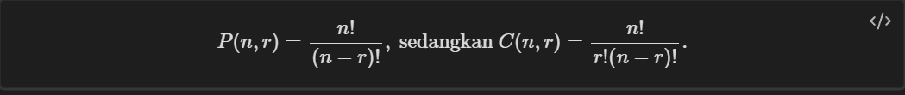
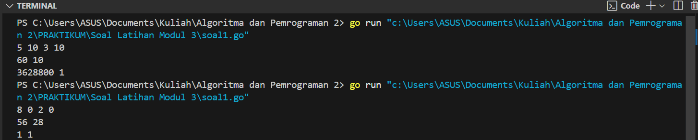
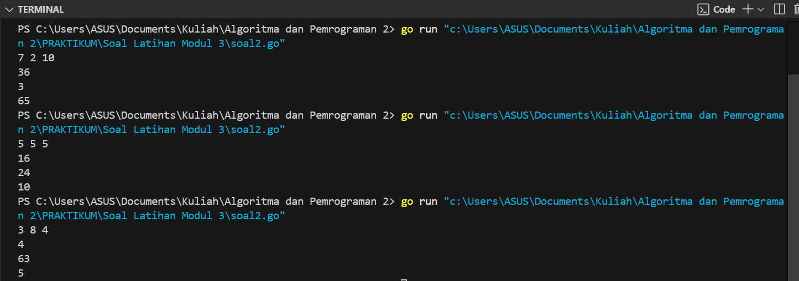
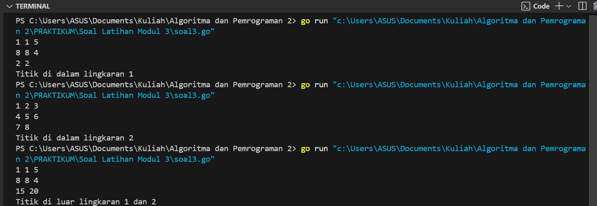

---
<h1 align="center">Laporan Praktikum Modul 3 <br>Fungsi</h1>

<p align="center">Tri Setyono Martyantoro - 103112400279</p>
<p align="center">S1IF - 12 - 05</p>


---
## Dasar Teori
---
### Fungsi

Fungsi merupakan satu kesatuan rangkaian instruksi yang memberikan atau menghasilkan suatu nilai dan biasanya memetakkan input ke suatu nilai yang lain. Oleh karena itu, fungsi selalu menghasilkan/mengembalikan nilai. Suatu subprogram dikatakan fungsi apabila: Ada deklarasi tipe nilai yang dikembalikan, dan Terdapat kata kunci return dalam badan subprogram. Maka fungsi digunakan jika suatu nilai biasanya diperlukan, seperti: Assignment nilai ke suatu variabel Bagian dari ekspresi Bagian dari argumen suatu subprogram, dsb.

---
## Soal Latihan Modul 3


---


> 1. Minggu ini, mahasiswa Fakultas Informatika mendapatkan tugas dari mata kuliah matematika diskrit untuk mempelajari kombinasi dan permutasi. Jonas salah seorang mahasiswa, iseng untuk mengimplementasikannya ke dalam suatu program. Oleh karena itu bersediakah kalian membantu Jonas? (tidak tentunya ya :p) Masukan terdiri dari empat buah bilangan asli 𝑎, 𝑏, 𝑐, dan 𝑑 yang dipisahkan oleh spasi, dengan syarat 𝑎 ≥ 𝑐 dan 𝑏 ≥ 𝑑. Keluaran terdiri dari dua baris. Baris pertama adalah hasil permutasi dan kombinasi 𝒂 terhadap 𝑐 , sedangkan baris kedua adalah hasil permutasi dan kombinasi 𝑏 terhadap 𝑑. Catatan: permutasi (P) dan kombinasi (C) dari 𝑛 terhadap 𝑟 (𝑛 ≥ 𝑟) dapat dihitung dengan menggunakan persamaan berikut!

```go
package main
import "fmt"

func factorial(n int) int {
    if n == 0 || n == 1 {
        return 1
    }
    hasil := 1
    for i := 2; i <= n; i++ {
        hasil *= i
    }
    return hasil
}
func permutasi(n, r int) int {
    if n < r {
        return 0
    }
    return factorial(n) / factorial(n-r)
}
func kombinasi(n, r int) int {
    if n < r {
        return 0
    }
    return factorial(n) / (factorial(r) * factorial(n-r))
}

func main() {
    var a, b, c, d, p1, p2, c1, c2 int

    fmt.Scan(&a, &b, &c, &d)

    p1 = permutasi(a, c)
    c1 = kombinasi(a, c)
    p2 = permutasi(b, d)
    c2 = kombinasi(b, d)

    fmt.Println(p1, c1)
    fmt.Println(p2, c2)
}
```
### Output Code

Program di atas digunakan untuk menghitung permutasi dan kombinasi dari dua pasang bilangan yang dimasukkan oleh pengguna. Algoritma dimulai dengan mendeklarasikan tiga fungsi, yaitu `factorial(n)`, `permutasi(n, r)`, dan `kombinasi(n, r)`. Fungsi `factorial(n)` menghitung faktorial dari `n` dengan menggunakan perulangan `for`, di mana nilai faktorial dihitung dengan mengalikan bilangan dari 2 hingga `n`. Fungsi `permutasi(n, r)` digunakan untuk menghitung permutasi `P(n, r)`, yaitu dengan menggunakan rumus `P(n, r) = n! / (n-r)!`. Fungsi ini memastikan bahwa jika `n < r`, hasilnya adalah 0. Fungsi `kombinasi(n, r)` digunakan untuk menghitung kombinasi `C(n, r)`, yaitu dengan rumus `C(n, r) = n! / (r!(n-r)!)`, dan jika `n < r`, hasilnya juga 0. Setelah mendefinisikan fungsi-fungsi tersebut, program meminta pengguna untuk memasukkan empat bilangan yang akan disimpan dalam variabel `a`, `b`, `c`, dan `d`. Program kemudian menghitung permutasi dan kombinasi untuk dua pasangan bilangan, yaitu `P(a, c)` dan `C(a, c)` yang hasilnya disimpan dalam variabel `p1` dan `c1`, serta `P(b, d)` dan `C(b, d)` yang hasilnya disimpan dalam variabel `p2` dan `c2`.

---

>  2.Diberikan tiga buah fungsi matematika yaitu 𝑓 (𝑥) = 𝑥 , 𝑔 (𝑥) = 𝑥 − 2 dan ℎ (𝑥) = 𝑥 +1. Fungsi komposisi (𝑓𝑜𝑔𝑜ℎ)(𝑥) artinya adalah 𝑓(𝑔ℎ(𝑥) ). Tuliskan 𝑓(𝑥), 𝑔(𝑥) dan ℎ(𝑥) dalam bentuk function. Masukan terdiri dari sebuah bilangan bulat 𝑎, 𝑏 dan 𝑐 yang dipisahkan oleh spasi. Keluaran terdiri dari tiga baris. Baris pertama adalah (𝑓𝑜𝑔𝑜ℎ)(𝑎), baris kedua (𝑔𝑜ℎ𝑜𝑓)(𝑏), dan baris ketiga adalah (ℎ𝑜𝑓𝑜𝑔)(𝑐)!

```go
package main
import "fmt"

func f(x int) int {
    return x * x
}

func g(x int) int {
    return x - 2
}

func h(x int) int {
    return x + 1
}

func main() {
    var a, b, c, fogoh, gohof, hofog int

    fmt.Scan(&a, &b, &c)

    fogoh = f(g(h(a)))
    gohof = g(h(f(b)))
    hofog = h(f(g(c)))

    fmt.Println(fogoh)
    fmt.Println(gohof)
    fmt.Println(hofog)
}
```
### Output Code

Program di atas adalah program yang digunakan untuk menghitung komposisi dari tiga fungsi matematika, yaitu fungsi `f(x)`, `g(x)`, dan `h(x)`, dengan tiga inputan angka. Algoritmanya dimulai dengan mendeklarasikan tiga fungsi, yaitu `f(x) = x * x`, yang mengembalikan kuadrat dari `x`, `g(x) = x - 2`, yang mengurangi nilai `x` dengan 2, dan `h(x) = x + 1`, yang menambahkan `x` dengan 1. Setelah itu, program meminta pengguna untuk memasukkan tiga angka yang akan disimpan dalam variabel `a`, `b`, dan `c`. Program kemudian menghitung hasil dari komposisi fungsi dengan berbagai urutan, yaitu `f(g(h(a)))`, yang berarti fungsi `h(a)` dihitung terlebih dahulu, kemudian hasilnya dimasukkan ke dalam fungsi `g(x)`, dan akhirnya hasilnya diproses dalam fungsi `f(x)`. Selanjutnya, program juga menghitung `g(h(f(b)))`, yang berarti fungsi `f(b)` dihitung terlebih dahulu, kemudian hasilnya dimasukkan ke dalam fungsi `h(x)`, dan akhirnya hasilnya diproses dalam fungsi `g(x)`. Terakhir, program menghitung `h(f(g(c)))`, yang berarti fungsi `g(c)` dihitung terlebih dahulu, kemudian hasilnya dimasukkan ke dalam fungsi `f(x)`, dan akhirnya hasilnya diproses dalam fungsi `h(x)`. 

---

> 3. Suatu lingkaran didefinisikan dengan koordinat titik pusat (𝑐𝑥,𝑐𝑦) dengan radius r . Apabila diberikan dua buah lingkaran, maka tentukan posisi sebuah titik sembarang (𝑥,𝑦) berdasarkan dua lingkaran tersebut. Masukan terdiri dari beberapa tiga baris. Baris pertama dan kedua adalah koordinat titik pusat dan radius dari lingkaran 1 dan lingkaran 2, sedangkan baris ketiga adalah koordinat titik sembarang. Asumsi sumbu x dan y dari semua titik dan juga radius direpresentasikan dengan bilangan bulat. Keluaran berupa string yang menyatakan posisi titik "Titik di dalam lingkaran 1 dan 2", "Titik di dalam lingkaran 1", "Titik di dalam lingkaran 2", atau "Titik di luar lingkaran 1 dan 2".

```go
package main
import (
    "fmt"
    "math"
)

func jarak(a, b, c, d float64) float64 {
    return math.Sqrt(math.Pow(a-c, 2) + math.Pow(b-d, 2))
}

func didalam(cx, cy, r, x, y float64) bool {
    return jarak(cx, cy, x, y) <= r
}

func main() {
    var cx1, cy1, r1, cx2, cy2, r2, x, y float64
    var ptitik1, ptitik2 bool

    fmt.Scan(&cx1, &cy1, &r1)
    fmt.Scan(&cx2, &cy2, &r2)
    fmt.Scan(&x, &y)

    ptitik1 = didalam(cx1, cy1, r1, x, y)
    ptitik2 = didalam(cx2, cy2, r2, x, y)

    if ptitik1 && ptitik2 {
        fmt.Println("Titik di dalam lingkaran 1 dan 2")
    } else if ptitik1 {
        fmt.Println("Titik di dalam lingkaran 1")
    } else if ptitik2 {
        fmt.Println("Titik di dalam lingkaran 2")
    } else {
        fmt.Println("Titik di luar lingkaran 1 dan 2")
    }
}
```
### Output Code

Program ini digunakan untuk mengecek apakah suatu titik berada di dalam satu atau dua lingkaran berdasarkan koordinat pusat dan radiusnya. Pertama, ada fungsi `jarak()` yang menghitung jarak antara dua titik menggunakan rumus Euclidean. Lalu, ada fungsi `didalam()` yang menentukan apakah titik berada di dalam lingkaran dengan membandingkan jaraknya ke pusat dengan radiusnya.
Di dalam `main()`, program membaca input untuk dua lingkaran (pusat dan radius) serta satu titik yang akan dicek. Kemudian, program mengevaluasi apakah titik tersebut masuk ke dalam lingkaran pertama, kedua, atau keduanya menggunakan fungsi `didalam()`. Hasilnya dicetak sesuai kondisi: apakah titik berada dalam satu lingkaran, dua lingkaran, atau di luar keduanya.

---


