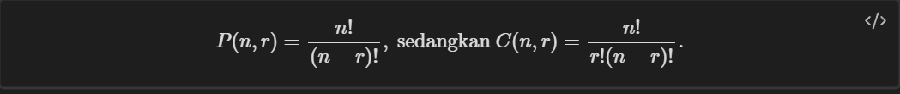
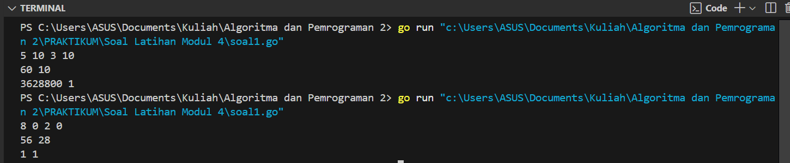
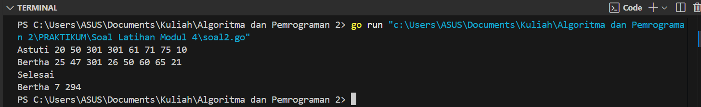
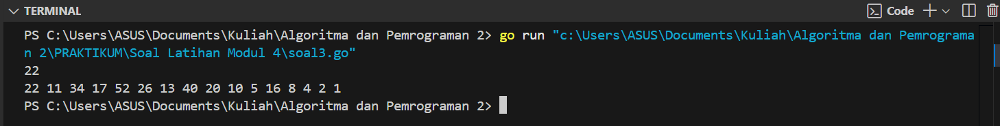

---
<h1 align="center">Laporan Praktikum Modul 4 <br>Prosedur</h1>

<p align="center">Tri Setyono Martyantoro - 103112400279</p>
<p align="center">S1IF - 12 - 05</p>


---
## Dasar Teori
---
### Prosedur

Prosedur dapat dianggap sebagai potongan beberapa instruksi program menjadi suatu instruksi baru yang dibuat untuk mengurangi kerumitan dari kode program yang kompleks pada suatu program yang besar. Prosedur akan menghasilkan suatu akibat atau efek langsung pada program ketika dipanggil pada program utama. Suatu subprogram dikatakan prosedur apabila: Tidak ada deklarasi tipe nilai yang dikembalikan, dan Tidak terdapat kata kunci return dalam badan subprogram. Kedudukannya prosedur sama seperti instruksi dasar yang sudah ada sebelumnya (assignment) dan/atau instruksi yang berasal dari paket (fmt), seperti fmt.Scan dan fmt.Print. Karena itu selalu pilih nama prosedur yang berbentuk kata kerja atau sesuatu yang merepresentasikan proses sebagai nama dari prosedur.

---
## Soal Latihan Modul 4


---


> 1. Minggu ini, mahasiswa Fakultas Informatika mendapatkan tugas dari mata kuliah matematika diskrit untuk mempelajari kombinasi dan permutasi. Jonas salah seorang mahasiswa, iseng untuk mengimplementasikannya ke dalam suatu program. Oleh karena itu bersediakah kalian membantu Jonas? (tidak tentunya ya :p) Masukan terdiri dari empat buah bilangan asli 𝑎, 𝑏, 𝑐, dan 𝑑 yang dipisahkan oleh spasi, dengan syarat 𝑎 ≥ 𝑐 dan 𝑏 ≥ 𝑑. Keluaran terdiri dari dua baris. Baris pertama adalah hasil permutasi dan kombinasi 𝒂 terhadap 𝑐 , sedangkan baris kedua adalah hasil permutasi dan kombinasi 𝑏 terhadap 𝑑. Catatan: permutasi (P) dan kombinasi (C) dari 𝑛 terhadap 𝑟 (𝑛 ≥ 𝑟) dapat dihitung dengan menggunakan persamaan berikut!

```go
package main
import "fmt"

func faktorial(n int, hasil *int) {
    *hasil = 1
    for i := 2; i <= n; i++ {
        *hasil *= i
    }
}

func Permutasi(n, r int, hasil *int) {
    var fn, fnr int
    faktorial(n, &fn)      
    faktorial(n-r, &fnr)    
    *hasil = fn / fnr      
}

func Kombinasi(n, r int, hasil *int) {
    var fn, fr, fnr int
    faktorial(n, &fn)      
    faktorial(r, &fr)      
    faktorial(n-r, &fnr)    
    *hasil = fn / (fr * fnr)
}

func main() {
    var a, b, c, d, permutasi, kombinasi int
    fmt.Scan(&a, &b, &c, &d)

    Permutasi(a, c, &permutasi)
    Kombinasi(a, c, &kombinasi)
    fmt.Println(permutasi, kombinasi)

    Permutasi(b, d, &permutasi)
    Kombinasi(b, d, &kombinasi)
    fmt.Println(permutasi, kombinasi)
}
```
### Output Code

Program di atas digunakan untuk menghitung permutasi dan kombinasi dari dua pasang bilangan yang dimasukkan oleh pengguna. Algoritma dimulai dengan mendeklarasikan tiga prosedur, yaitu `faktorial(n, *hasil)`, `Permutasi(n, r, *hasil)`, dan `Kombinasi(n, r, *hasil)`. Prosedur `faktorial(n, *hasil)` digunakan untuk menghitung faktorial dari `n` dengan menggunakan perulangan `for`, di mana nilai faktorial dihitung dengan mengalikan bilangan dari 2 hingga `n`. Prosedur `Permutasi(n, r, *hasil)` digunakan untuk menghitung permutasi `P(n, r)`, yaitu dengan menggunakan rumus `P(n, r) = n! / (n-r)!`. Prosedur `Kombinasi(n, r, *hasil)` digunakan untuk menghitung kombinasi `C(n, r)`, yaitu dengan rumus `C(n, r) = n! / (r!(n-r)!)`. Setelah mendefinisikan prosedur-prosedur tersebut, program meminta pengguna untuk memasukkan empat bilangan yang akan disimpan dalam variabel `a`, `b`, `c`, dan `d`. Program kemudian menghitung permutasi dan kombinasi untuk dua pasangan bilangan, yaitu `P(a, c)` dan `C(a, c)` yang hasilnya disimpan dalam variabel `permutasi` dan `kombinasi`, serta `P(b, d)` dan `C(b, d)`.

---

>  2.Kompetisi pemrograman tingkat nasional berlangsung ketat. Setiap peserta diberikan 8 soal yang harus dapat diselesaikan dalam waktu 5 jam saja. Peserta yang berhasil menyelesaikan soal paling banyak dalam waktu paling singkat adalah pemenangnya. Buat program gema yang mencari pemenang dari daftar peserta yang diberikan. Program harus dibuat modular, yaitu dengan membuat prosedur hitungSkor yang mengembalikan total soal dan total skor yang dikerjakan oleh seorang peserta, melalui parameter formal. Pembacaan nama peserta dilakukan di program utama, sedangkan waktu pengerjaan dibaca di dalam prosedur.

```
prosedure hitungSkor(in/out soal, skor : integer)
```

> Setiap baris masukan dimulai dengan satu string nama peserta tersebut diikuti dengan adalah 8 integer yang menyatakan berapa lama (dalam menit) peserta tersebut menyelesaikan soal. Jika tidak berhasil atau tidak mengirimkan jawaban maka otomatis dianggap menyelesaikan dalam waktu 5 jam 1 menit (301 menit). Satu baris keluaran berisi nama pemenang, jumlah soal yang diselesaikan, dan nilai yang diperoleh. Nilai adalah total waktu yang dibutuhkan untuk menyelesaikan soal yang berhasil diselesaikan.

```go
package main
import "fmt"

func Waktu(t1, t2, t3, t4, t5, t6, t7, t8 *int) {
    fmt.Scan(t1, t2, t3, t4, t5, t6, t7, t8)
}

func hitungSkor(t1, t2, t3, t4, t5, t6, t7, t8 int, soal *int, skor *int) {
    *soal, *skor = 0, 0
    if t1 <= 300 { *soal++; *skor += t1 }
    if t2 <= 300 { *soal++; *skor += t2 }
    if t3 <= 300 { *soal++; *skor += t3 }
    if t4 <= 300 { *soal++; *skor += t4 }
    if t5 <= 300 { *soal++; *skor += t5 }
    if t6 <= 300 { *soal++; *skor += t6 }
    if t7 <= 300 { *soal++; *skor += t7 }
    if t8 <= 300 { *soal++; *skor += t8 }
}

func main() {
    var nama, pemenang string
    var soal, skor, soalmax, minskor int
    var t1, t2, t3, t4, t5, t6, t7, t8 int

    soalmax = -1  
    minskor = 99999  

    for {
        fmt.Scan(&nama)
        if nama == "Selesai" {
            break
        }

        Waktu(&t1, &t2, &t3, &t4, &t5, &t6, &t7, &t8)
        hitungSkor(t1, t2, t3, t4, t5, t6, t7, t8, &soal, &skor)

        if soal > soalmax || (soal == soalmax && skor < minskor) {
            soalmax = soal
            minskor = skor
            pemenang = nama
        }
    }
    fmt.Println(pemenang, soalmax, minskor)
}
```
### Output Code

Program di atas digunakan untuk menentukan pemenang dalam sebuah kompetisi pemrograman berdasarkan jumlah soal yang berhasil diselesaikan dalam waktu maksimal 300 menit per soal serta total waktu yang digunakan. Program ini dibuat secara modular dengan dua prosedur utama, yaitu `Waktu()` dan `hitungSkor()`. Prosedur `Waktu()` berfungsi untuk membaca waktu penyelesaian delapan soal dari input yang diberikan oleh pengguna. Di dalam prosedur `hitungSkor()`, setiap soal diperiksa apakah waktu penyelesaiannya kurang dari atau sama dengan 300 menit. Jika iya, jumlah soal yang berhasil diselesaikan bertambah satu dan total waktu pengerjaan diperbarui dengan menjumlahkan waktu soal tersebut. Penentuan pemenang didasarkan pada peserta dengan jumlah soal terbanyak. Jika ada peserta dengan jumlah soal yang sama, pemenang ditentukan dari total waktu pengerjaan yang lebih kecil. Program terus menerima input hingga peserta memasukkan "Selesai", lalu mencetak nama pemenang, jumlah soal yang diselesaikan, dan total waktu pengerjaan.

---

> 3. Skiena dan Revilla dalam Programming Challenges mendefinisikan sebuah deret bilangan. Deret dimulai dengan sebuah bilangan bulat n. Jika bilangan n saat itu genap, maka suku berikutnya adalah ½n, tetapi jika ganjil maka suku berikutnya bernilai 3n+1. Rumus yang sama digunakan terus menerus untuk mencari suku berikutnya. Deret berakhir ketika suku terakhir bernilai 1. Sebagai contoh jika dimulai dengan n=22, maka deret bilangan yang diperoleh adalah:

```
22 11 34 17 52 26 13 40 20 10 5 16 8 4 2 1
```


> Untuk suku awal sampai dengan 1000000, diketahui deret selalu mencapai suku dengan nilai 1. Buat program skiena yang akan mencetak setiap suku dari deret yang dijelaskan di atas untuk nilai suku awal yang diberikan. Pencetakan deret harus dibuat dalam prosedur cetakDeret yang mempunyai 1 parameter formal, yaitu nilai dari suku awal.

```
prosedure cetakDeret(in n : integer )
```

> Masukan berupa satu bilangan integer positif yang lebih kecil dari 1000000. 
> Keluaran terdiri dari satu baris saja. Setiap suku dari deret tersebut dicetak dalam baris yang dan dipisahkan oleh sebuah spasi.

```go
package main
import "fmt"

func cetakDeret(n int) {
    for n != 1 {
        fmt.Print(n, " ")
        if n%2 == 0 {
            n /= 2
        } else {
            n = 3*n + 1
        }
    }
    fmt.Println(1)
}

func main() {
    var bilangan int
    fmt.Scan(&bilangan)

    if bilangan <= 0 || bilangan >= 1000000 {
        return
    }
    cetakDeret(bilangan)
}
```
### Output Code

Program di atas digunakan untuk mencetak deret bilangan berdasarkan aturan Collatz. Program ini dibuat secara modular dengan prosedur utama `cetakDeret()`. Di dalam prosedur `cetakDeret()`, bilangan yang diberikan akan diperiksa apakah bernilai genap atau ganjil. Jika bilangan tersebut genap, maka bilangan selanjutnya diperoleh dengan membaginya dengan dua. Jika bilangan tersebut ganjil, maka bilangan selanjutnya dihitung menggunakan rumus `3n + 1`. Proses ini terus berlangsung hingga bilangan mencapai nilai `1`, yang menandai akhir dari deret.
Saat program dijalankan, pengguna diminta memasukkan sebuah bilangan bulat positif yang lebih kecil dari 1.000.000. Jika input lebih dari 1.000.000, program akan berhenti. Namun, jika input valid, prosedur `cetakDeret()` akan dipanggil untuk mencetak deret sesuai dengan aturan yang telah dijelaskan.

---


