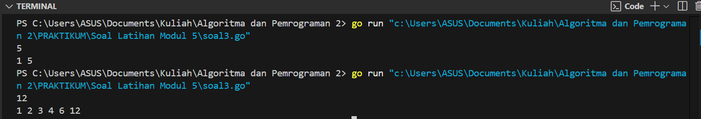

---
<h1 align="center">Laporan Praktikum Modul 5 <br>Rekursif</h1>

<p align="center">Tri Setyono Martyantoro - 103112400279</p>
<p align="center">S1IF - 12 - 05</p>


---
## Dasar Teori
---
### Rekursif

Rekursi merupakan teknik pemrograman di mana suatu fungsi memanggil dirinya sendiri untuk menyelesaikan sebuah permasalahan. Teknik ini biasanya diterapkan pada masalah yang dapat dipecah menjadi sub-masalah lebih kecil dengan pola yang sama. Rekursi terdiri dari dua komponen utama, yaitu **base case**, yang berfungsi sebagai kondisi penghentian, dan **recursive case**, di mana fungsi terus memanggil dirinya sendiri dengan parameter yang semakin mendekati base case.

---
## Soal Latihan Modul 5


---


> 1. Deret fibonacci adalah sebuah deret dengan nilai suku ke-0 dan ke-1 adalah 0 dan 1, dan nilai suku ke-n selanjutnya adalah hasil penjumlahan dua suku sebelumnya. Secara umum dapat diformulasikan 𝑆𝑛 = 𝑆𝑛−1 + 𝑆𝑛−2 . Berikut ini adalah contoh nilai deret fibonacci hingga suku ke-10. Buatlah program yang mengimplementasikan fungsi rekursif pada deret fibonacci tersebut.

<table border="1" cellspacing="0" cellpadding="5">
  <tr>
    <th>n</th>
    <td>0</td>
    <td>1</td>
    <td>2</td>
    <td>3</td>
    <td>4</td>
    <td>5</td>
    <td>6</td>
    <td>7</td>
    <td>8</td>
    <td>9</td>
    <td>10</td>
  </tr>
  <tr>
    <th>Sn</th>
    <td>0</td>
    <td>1</td>
    <td>1</td>
    <td>2</td>
    <td>3</td>
    <td>5</td>
    <td>8</td>
    <td>13</td>
    <td>21</td>
    <td>34</td>
    <td>55</td>
  </tr>
</table>


```go
package main
import "fmt"

func fibonacci(n int) int {
    if n < 2 {
        return n
    }
    return fibonacci(n-1) + fibonacci(n-2)
}

func deretFibonacci(i, n int) {
    fmt.Print(fibonacci(i), " ")
    if i < n {
        deretFibonacci(i+1, n)
    }
}

func main() {
    var n int
    fmt.Scan(&n)
    deretFibonacci(0, n)
}
```
### Output Code

Program di atas digunakan untuk menghasilkan deret Fibonacci hingga bilangan ke- _n_ yang dimasukkan oleh pengguna. Algoritma dimulai dengan mendefinisikan satu fungsi, yaitu _fibonacci_, dan satu prosedur, yaitu _deretFibonacci_.
Fungsi _fibonacci_ digunakan untuk menghitung bilangan Fibonacci ke- _n_ secara rekursif. Jika _n_ kurang dari 2, fungsi akan langsung mengembalikan nilai _n_. Jika tidak, fungsi akan memanggil dirinya sendiri dengan _fibonacci(n-1) + fibonacci(n-2)_, sesuai dengan rumus dasar Fibonacci.
Prosedur _deretFibonacci_ digunakan untuk mencetak deret Fibonacci dari _i_ hingga _n_. Prosedur ini mencetak hasil dari _fibonacci(i)_, lalu memanggil dirinya sendiri dengan _i+1_ jika _i_ masih lebih kecil dari _n_, sehingga proses rekursi terus berjalan hingga mencapai batas _n_.
Setelah mendefinisikan fungsi dan prosedur tersebut, program meminta pengguna untuk memasukkan sebuah bilangan _n_. Nilai _n_ yang dimasukkan akan menentukan panjang deret Fibonacci yang dihasilkan. Program kemudian memanggil prosedur _deretFibonacci(0, n)_ untuk mencetak deret Fibonacci dari 0 hingga _n_.

---

>  2.Buatlah sebuah program yang digunakan untuk menampilkan pola bintang berikut ini dengan menggunakan fungsi rekursif. N adalah masukan dari user.

<table>
  <tr>
    <th>No</th>
    <th>Masukan</th>
    <th>Keluaran</th>
  </tr>
  <tr>
    <td>1</td>
    <td>5</td>
    <td>*<br>**<br>***<br>****<br>*****</td>
  </tr>
  <tr>
    <td>2</td>
    <td>1</td>
    <td>*</td>
  </tr>
  <tr>
    <td>3</td>
    <td>3</td>
    <td>*<br>**<br>***</td>
  </tr>
</table>


```go
package main
import "fmt"

func cetakBintang(n int) {
    if n != 0 {
        fmt.Print("*")
        cetakBintang(n - 1)
    }
}

func pola(n, baris int) {
    if baris <= n {
        cetakBintang(baris)
        fmt.Println()
        pola(n, baris+1)
    }
}

func main() {
    var n int
    fmt.Scan(&n)
    pola(n, 1)
}
```
### Output Code

Program di atas digunakan untuk mencetak pola segitiga bintang secara rekursif berdasarkan jumlah baris yang dimasukkan oleh pengguna. Algoritma ini terdiri dari dua prosedur utama, yaitu _cetakBintang_ dan _pola_.
Prosedur _cetakBintang_ berfungsi untuk mencetak bintang sebanyak _n_ secara rekursif. Jika _n_ tidak sama dengan nol, prosedur ini akan mencetak satu bintang dan kemudian memanggil dirinya sendiri dengan parameter _n-1_ hingga _n_ mencapai nol.
Prosedur _pola_ berfungsi untuk mencetak pola segitiga bintang dari satu hingga _n_ baris. Prosedur ini akan memanggil _cetakBintang_ dengan parameter _baris_, mencetak baris baru, lalu memanggil dirinya sendiri dengan _baris+1_ hingga jumlah baris mencapai _n_.
Setelah mendefinisikan prosedur tersebut, program meminta pengguna untuk memasukkan sebuah bilangan _n_, yang menentukan tinggi segitiga bintang yang akan dicetak. Program kemudian memanggil prosedur _pola(n, 1)_ untuk mencetak pola bintang dari baris pertama hingga baris ke-_n_.

---

> 3. Buatlah program yang mengimplementasikan rekursif untuk menampilkan faktor bilangan dari suatu N, atau bilangan yang apa saja yang habis membagi N. Masukan terdiri dari sebuah bilangan bulat positif N. Keluaran terdiri dari barisan bilangan yang menjadi faktor dari N (terurut dari 1 hingga N ya).

<table border="1" cellspacing="0" cellpadding="5">
  <tr>
    <th>No</th>
    <th>Masukan</th>
    <th>Keluaran</th>
  </tr>
  <tr>
    <td>1</td>
    <td>5</td>
    <td>1 5</td>
  </tr>
  <tr>
    <td>2</td>
    <td>12</td>
    <td>1 2 3 4 6 12</td>
  </tr>
</table>

```go
package main
import "fmt"

func faktorBilangan(n, i int) {
    if i <= n {
        if n%i == 0 {
        fmt.Print(i, " ")
        }
        faktorBilangan(n, i+1)
    }
}

func main() {
    var n int
    fmt.Scan(&n)
    faktorBilangan(n, 1)
}
```
### Output Code

Program ini digunakan untuk mencari dan mencetak faktor-faktor dari suatu bilangan yang dimasukkan oleh pengguna menggunakan metode rekursif. Algoritma ini terdiri dari satu prosedur utama, yaitu _faktorBilangan_.
Prosedur _faktorBilangan_ berfungsi untuk mencari faktor dari bilangan _n_ dengan menggunakan rekursi. Jika _i_ masih lebih kecil atau sama dengan _n_, prosedur ini akan mengecek apakah _n_ habis dibagi _i_ (dengan kondisi _n % i == 0_). Jika iya, maka _i_ dicetak sebagai faktor, lalu prosedur akan memanggil dirinya sendiri dengan parameter _i+1_ hingga mencapai _n_.
Setelah mendefinisikan prosedur tersebut, program meminta pengguna untuk memasukkan sebuah bilangan _n_. Program kemudian memanggil prosedur _faktorBilangan(n, 1)_ untuk mencetak semua faktor dari bilangan tersebut secara rekursif.

---

> 4.Buatlah program yang mengimplementasikan rekursif untuk menampilkan barisan bilangan tertentu. Masukan terdiri dari sebuah bilangan bulat positif N. Keluaran terdiri dari barisan bilangan dari N hingga 1 dan kembali ke N.

<table border="1">
  <tr>
    <th>No</th>
    <th>Masukan</th>
    <th>Keluaran</th>
  </tr>
  <tr>
    <td>1</td>
    <td>5</td>
    <td>5 4 3 2 1 2 3 4 5</td>
  </tr>
  <tr>
    <td>2</td>
    <td>9</td>
    <td>9 8 7 6 5 4 3 2 1 2 3 4 5 6 7 8 9</td>
  </tr>
</table>

```go
package main
import "fmt"

func barisan(n, bilangan int) {
    fmt.Print(bilangan, " ")
    if bilangan > 1 {
        barisan(n, bilangan-1)
        fmt.Print(bilangan, " ")
    }
}

func main() {
    var n int
    fmt.Scan(&n)
    barisan(n, n)
}
```
### Output Code

Program ini digunakan untuk mencetak suatu barisan angka secara rekursif berdasarkan bilangan yang dimasukkan oleh pengguna. Algoritma ini terdiri dari satu prosedur utama, yaitu _barisan_.
Prosedur _barisan_ berfungsi untuk mencetak bilangan dari _n_ hingga 1 secara menurun, lalu mencetak kembali bilangan tersebut secara menaik setelah mencapai 1. Pada setiap pemanggilan, prosedur mencetak nilai _bilangan_, kemudian memanggil dirinya sendiri dengan parameter _bilangan-1_ hingga nilai _bilangan_ mencapai 1. Setelah pemanggilan rekursif selesai, nilai _bilangan_ kembali dicetak untuk membentuk pola simetris.
Setelah mendefinisikan prosedur tersebut, program meminta pengguna untuk memasukkan sebuah bilangan _n_. Program kemudian memanggil prosedur _barisan(n, n)_ untuk mencetak pola angka dari _n_ ke 1, lalu kembali ke _n_.

---

> 5. Buatlah program yang mengimplementasikan rekursif untuk menampilkan barisan bilangan ganjil. Masukan terdiri dari sebuah bilangan bulat positif N. Keluaran terdiri dari barisan bilangan ganjil dari 1 hingga N. Contoh masukan dan keluaran:

<table border="1">
  <tr>
    <th>No</th>
    <th>Masukan</th>
    <th>Keluaran</th>
  </tr>
  <tr>
    <td>1</td>
    <td>5</td>
    <td>1 3 5</td>
  </tr>
  <tr>
    <td>2</td>
    <td>20</td>
    <td>1 3 5 7 9 11 13 15 17 19</td>
  </tr>
	</table>

```go
package main
import "fmt"

func ganjil(i, bilangan int) {
    if i <= bilangan {
        fmt.Print(i, " ")
        ganjil(i+2, bilangan)
    }
}

func main() {
    var n int
    fmt.Scan(&n)
    ganjil(1, n)
}
```
### Output Code

Program ini digunakan untuk mencetak bilangan ganjil dari 1 hingga _n_ menggunakan metode rekursif. Algoritma ini terdiri dari satu prosedur utama, yaitu _ganjil_.
Prosedur _ganjil_ berfungsi untuk mencetak bilangan ganjil secara rekursif. Jika _i_ masih lebih kecil atau sama dengan _bilangan_, prosedur ini akan mencetak nilai _i_, lalu memanggil dirinya sendiri dengan parameter _i+2_ hingga nilai _i_ melebihi _bilangan_.
Setelah mendefinisikan prosedur tersebut, program meminta pengguna untuk memasukkan sebuah bilangan _n_. Program kemudian memanggil prosedur _ganjil(1, n)_ untuk mencetak bilangan ganjil dari 1 hingga _n_ secara rekursif.

---

> 6. Buatlah program yang mengimplementasikan rekursif untuk mencari hasil pangkat dari dua buah bilangan. Masukan terdiri dari bilangan bulat x dan y. Keluaran terdiri dari hasil x dipangkatkan y. Catatan: diperbolehkan menggunakan asterik "", tapi dilarang menggunakan import "math". Contoh masukan dan keluaran:

<table border="1">
  <tr>
    <th>No</th>
    <th>Masukan</th>
    <th>Keluaran</th>
  </tr>
  <tr>
    <td>1</td>
    <td>2 2</td>
    <td>4</td>
  </tr>
  <tr>
    <td>2</td>
    <td>5 3</td>
    <td>125</td>
  </tr>
	</table>

```go
package main
import "fmt"

func pangkat(x, y int) int {
    if y == 0 {
        return 1
    }
    return x * pangkat(x, y-1)
}

func main() {
    var x, y int
    fmt.Scan(&x, &y)
    fmt.Println(pangkat(x, y))
}
```
### Output Code

Program ini digunakan untuk menghitung hasil perpangkatan suatu bilangan menggunakan metode rekursif. Algoritma ini terdiri dari satu fungsi utama, yaitu _pangkat_.
Prosedur _pangkat_ berfungsi untuk menghitung hasil dari _x^y_ secara rekursif. Jika nilai _y_ sama dengan 0, maka fungsi mengembalikan 1 sebagai base case (karena bilangan berpangkat 0 selalu bernilai 1). Jika tidak, fungsi akan mengembalikan hasil perkalian antara _x_ dan pemanggilan dirinya sendiri dengan eksponen yang dikurangi satu (_y-1_), hingga mencapai base case.
Setelah mendefinisikan prosedur tersebut, program meminta pengguna untuk memasukkan dua bilangan, yaitu _x_ sebagai bilangan yang akan dipangkatkan dan _y_ sebagai eksponennya. Program kemudian memanggil fungsi _pangkat(x, y)_ untuk menghitung hasil pangkat secara rekursif dan mencetak hasilnya.

---
