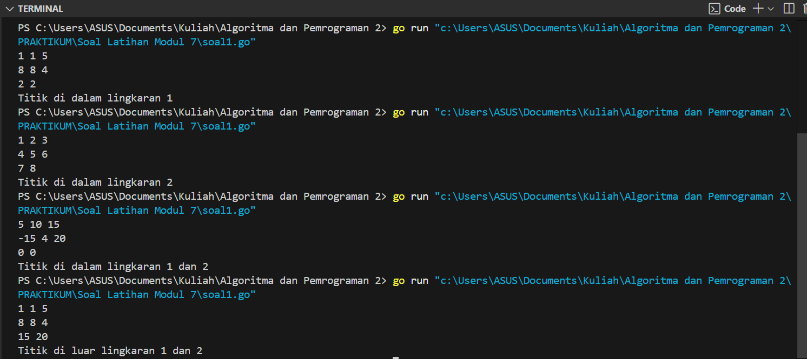
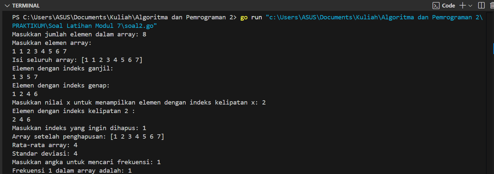
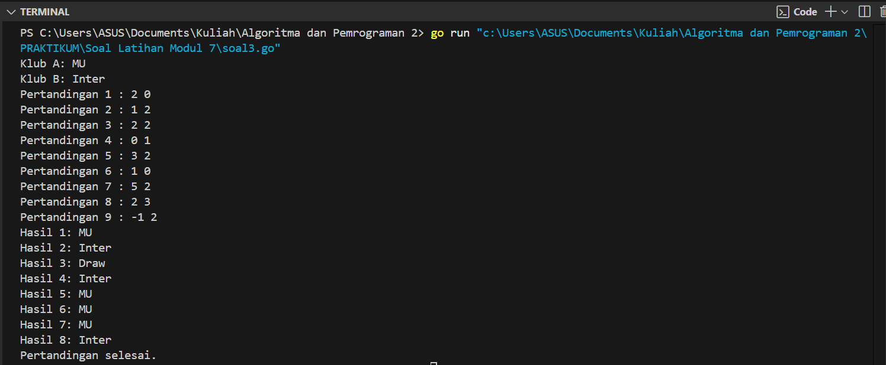
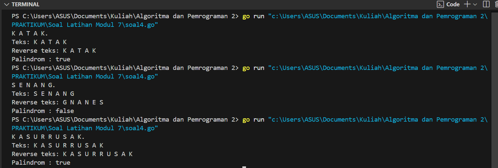

---
<h1 align="center">Laporan Praktikum Modul 7 <br>Struct & Array</h1>

<p align="center">Tri Setyono Martyantoro - 103112400279</p>
<p align="center">S1IF - 12 - 05</p>


---
## Dasar Teori
---
### Struct (Tipe Bentukan)

Tipe bentukan dalam pemrograman memungkinkan pengelompokan dan penyesuaian tipe data sesuai kebutuhan, yang terbagi menjadi **Alias (Type)** dan **Struct (Record)**. **Alias** digunakan untuk memberi nama baru pada tipe data agar lebih ringkas dan mudah dipahami, seperti mengganti `int` menjadi `bilangan`. **Struct**, di sisi lain, memungkinkan pengelompokan beberapa nilai dengan tipe data yang berbeda dalam satu kesatuan
### Array

Selain itu, dalam pemrograman Go, terdapat **Array**, **Slice**, dan **Map** sebagai struktur data penting. **Array** memiliki jumlah elemen tetap, sedangkan **Slice** adalah versi dinamisnya yang dapat bertambah atau berkurang sesuai kebutuhan. **Map** merupakan struktur data asosiatif yang memungkinkan penyimpanan data dengan kunci unik yang tidak terbatas pada tipe numerik, tetapi bisa berupa string atau tipe lainnya.

---
## Soal Latihan Modul 7


---


> 1. Suatu lingkaran didefinisikan dengan koordinat titik pusat (𝑐𝑥,𝑐𝑦) dengan radius 𝑟. Apabila diberikan dua buah lingkaran, maka tentukan posisi sebuah titik sembarang (𝑥,𝑦) berdasarkan dua lingkaran tersebut. Gunakan tipe bentukan titik untuk menyimpan koordinat, dan tipe bentukan lingkaran untuk menyimpan titik pusat lingkaran dan radiusnya. Masukan terdiri dari beberapa tiga baris. Baris pertama dan kedua adalah koordinat titik pusat dan radius dari lingkaran 1 dan lingkaran 2, sedangkan baris ketiga adalah koordinat titik sembarang. Asumsi sumbu x dan y dari semua titik dan juga radius direpresentasikan dengan bilangan bulat. Keluaran berupa string yang menyatakan posisi titik "Titik di dalam lingkaran 1 dan 2", "Titik di dalam lingkaran 1", "Titik di dalam lingkaran 2", atau "Titik di luar lingkaran 1 dan 2".

<table border="1" cellpadding="10" cellspacing="0" style="border-collapse: collapse; width: 100%; text-align: center;">
    <thead>
        <tr>
            <th>No</th>
            <th>Masukan</th>
            <th>Keluaran</th>
        </tr>
    </thead>
    <tbody>
        <tr>
            <td>1</td>
            <td>
                <pre>1  1  5</pre>
                <pre>8  8  4</pre>
                <pre>2  2</pre>
            </td>
            <td>Titik di dalam lingkaran 1</td>
        </tr>
        <tr>
            <td>2</td>
            <td>
                <pre>1  2  3</pre>
                <pre>4  5  6</pre>
                <pre>7  8</pre>
            </td>
            <td>Titik di dalam lingkaran 2</td>
        </tr>
        <tr>
            <td>3</td>
            <td>
                <pre>5  10  15</pre>
                <pre>-15  4  20</pre>
                <pre>0  0</pre>
            </td>
            <td>Titik di dalam lingkaran 1 dan 2</td>
        </tr>
        <tr>
            <td>4</td>
            <td>
                <pre>1  1  5</pre>
                <pre>8  8  4</pre>
                <pre>15  20</pre>
            </td>
            <td>Titik di luar lingkaran 1 dan 2</td>
        </tr>
    </tbody>
</table>


> Fungsi untuk menghitung jarak titik (a, b) dan (c, d) dimana rumus jarak adalah:
<p style="text-align: center; font-size: 18px;">
    𝑗𝑎𝑟𝑎𝑘 = √((𝑎 - 𝑐)² + (𝑏 - 𝑑)²)
</p>
> dan juga fungsi untuk menentukan posisi sebuah titik sembarang berada di dalam suatu lingkaran atau tidak.


```
function jarak(p, q : titik) -> real 
{Mengembalikan jarak antara titik p(x,y) dan titik q(x,y)} 

function didalam(c:lingkaran, p:titik) -> boolean 
{Mengembalikan true apabila titik p(x,y) berada di dalam lingkaran c yang memiliki titik pusat (cx,cy) dan radius r}
```


```go
package main
import (
    "fmt"
    "math"
)

type Lingkaran struct {
    cx, cy, r float64
}

type Titik struct {
    x, y float64
}

func jarak(a, b, c, d float64) float64 {
    return math.Sqrt(math.Pow(a-c, 2) + math.Pow(b-d, 2))
}

func didalam(l Lingkaran, t Titik) bool {
    return jarak(l.cx, l.cy, t.x, t.y) <= l.r
}

func main() {
    var l1, l2 Lingkaran
    var t Titik
    var dalam1, dalam2 bool

    fmt.Scan(&l1.cx, &l1.cy, &l1.r)
    fmt.Scan(&l2.cx, &l2.cy, &l2.r)
    fmt.Scan(&t.x, &t.y)

    dalam1 = didalam(l1, t)
    dalam2 = didalam(l2, t)

    if dalam1 && dalam2 {
        fmt.Println("Titik di dalam lingkaran 1 dan 2")
    } else if dalam1 {
        fmt.Println("Titik di dalam lingkaran 1")
    } else if dalam2 {
        fmt.Println("Titik di dalam lingkaran 2")
    } else {
        fmt.Println("Titik di luar lingkaran 1 dan 2")
    }
}
```
### Output Code

Program di atas digunakan untuk menentukan apakah sebuah titik berada di dalam salah satu atau kedua lingkaran berdasarkan koordinat dan jari-jari yang dimasukkan oleh pengguna. Algoritma ini terdiri dari tiga bagian utama, yaitu tipe bentukan Lingkaran dan Titik, fungsi jarak, serta fungsi didalam. Tipe bentukan Lingkaran berfungsi untuk merepresentasikan sebuah lingkaran dengan menyimpan koordinat pusat (cx, cy) dan jari-jari r. Tipe bentukan Titik digunakan untuk menyimpan koordinat titik (x, y) yang akan diuji posisinya terhadap lingkaran. Fungsi `jarak` digunakan untuk menghitung jarak antara dua titik dalam bidang dua dimensi menggunakan rumus Euclidean. Fungsi `didalam` digunakan untuk menentukan apakah sebuah titik berada di dalam lingkaran. Setelah mendefinisikan fungsi-fungsi tersebut, program meminta pengguna untuk memasukkan data dua lingkaran, yaitu koordinat pusat dan jari-jari masing-masing, serta koordinat titik yang akan diuji. Program kemudian memanggil fungsi `didalam` untuk mengecek apakah titik tersebut berada di dalam salah satu atau kedua lingkaran.

---

>  2.Sebuah array digunakan untuk menampung sekumpulan bilangan bulat. Buatlah program yang digunakan untuk mengisi array tersebut sebanyak N elemen nilai. Asumsikan array memiliki kapasitas penyimpanan data sejumlah elemen tertentu. Program dapat menampilkan beberapa informasi berikut: 
>  a. Menampilkan keseluruhan isi dari array. 
>  b. Menampilkan elemen-elemen array dengan indeks ganjil saja. 
>  c. Menampilkan elemen-elemen array dengan indeks genap saja (asumsi indek ke-0 adalah genap).
>  d. Menampilkan elemen-elemen array dengan indeks kelipatan bilangan x. x bisa diperoleh dari masukan pengguna.
>  e. Menghapus elemen array pada indeks tertentu, asumsi indeks yang hapus selalu valid. Tampilkan keseluruhan isi dari arraynya, pastikan data yang dihapus tidak tampil.
>  f. Menampilkan rata-rata dari bilangan yang ada di dalam array.
>  g. Menampilkan standar deviasi atau simpangan baku dari bilangan yang ada di dalam array tersebut.
>  h. Menampilkan frekuensi dari suatu bilangan tertentu di dalam array yang telah diisi tersebut.

```go
package main
import "fmt"

func main() {
    var n, x, index, cari, sum, jumlah int
    var ratarata, variansi, stdeviasi, selisih float64

    fmt.Print("Masukkan jumlah elemen dalam array: ")
    fmt.Scan(&n)

    var arr []int = make([]int, n)
    fmt.Println("Masukkan elemen array:")
    for i := 0; i < n; i++ {
        fmt.Scan(&arr[i])
    }
    fmt.Println("Isi seluruh array:", arr)

    fmt.Println("Elemen dengan indeks ganjil:")
    for i := 1; i < n; i += 2 {
        fmt.Print(arr[i], " ")
    }
    fmt.Println()

    fmt.Println("Elemen dengan indeks genap:")
    for i := 0; i < n; i += 2 {
        fmt.Print(arr[i], " ")
    }
    fmt.Println()

    fmt.Print("Masukkan nilai x untuk menampilkan elemen dengan indeks kelipatan x: ")
    fmt.Scan(&x)
    fmt.Println("Elemen dengan indeks kelipatan", x, ":")
    for i := x; i < n; i += x {
        fmt.Print(arr[i], " ")
    }
    fmt.Println()

    fmt.Print("Masukkan indeks yang ingin dihapus: ")
    fmt.Scan(&index)
    if index >= 0 && index < len(arr) {
        arr = append(arr[:index], arr[index+1:]...)
        fmt.Println("Array setelah penghapusan:", arr)
    } else {
        fmt.Println("Indeks tidak valid")
    }

    sum = 0
    for i := 0; i < len(arr); i++ {
        sum += arr[i]
    }
    ratarata = float64(sum) / float64(len(arr))
    fmt.Println("Rata-rata array:", ratarata)

    variansi = 0
    for i := 0; i < len(arr); i++ {
        selisih  = float64(arr[i]) - ratarata
        variansi += selisih * selisih
    }
    stdeviasi = variansi / float64(len(arr))
    fmt.Println("Standar deviasi:", stdeviasi)

    fmt.Print("Masukkan angka untuk mencari frekuensi: ")
    fmt.Scan(&cari)
    jumlah = 0
    for i := 0; i < len(arr); i++ {
        if arr[i] == cari {
            jumlah++
        }
    }
    fmt.Println("Frekuensi", cari, "dalam array adalah:", jumlah)
}
```
### Output Code

Program di atas bertujuan untuk melakukan berbagai operasi pada array bilangan bulat yang dimasukkan oleh pengguna. Pertama, program meminta pengguna untuk menentukan jumlah elemen dalam array dan menginput nilainya. Setelah itu, program menampilkan seluruh isi array serta elemen-elemen dengan indeks ganjil dan genap. Program juga memungkinkan pengguna untuk memilih bilangan tertentu sebagai kelipatan indeks dan menampilkan elemen-elemen yang berada di indeks tersebut. Selain itu, program mendukung penghapusan elemen pada indeks tertentu yang dipilih oleh pengguna, dengan memastikan array tetap valid setelah penghapusan. Selanjutnya, program menghitung rata-rata nilai dalam array serta standar deviasinya untuk melihat sebaran data. Terakhir, program meminta pengguna untuk memasukkan bilangan tertentu dan menghitung berapa kali bilangan tersebut muncul dalam array.

---

> 3. Sebuah program digunakan untuk menyimpan dan menampilkan nama-nama klub yang memenangkan pertandingan bola pada suatu grup pertandingan. Buatlah program yang digunakan untuk merekap skor pertandingan bola 2 buah klub bola yang berlaga. Pertama-tama program meminta masukan nama-nama klub yang bertanding, kemudian program meminta masukan skor hasil pertandingan kedua klub tersebut. Yang disimpan dalam array adalah nama-nama klub yang menang saja. Proses input skor berhenti ketika skor salah satu atau kedua klub tidak valid (negatif). Di akhir program, tampilkan daftar klub yang memenangkan pertandingan. Perhatikan sesi interaksi pada contoh berikut ini (teks bergaris bawah adalah input/read)

<h2>Hasil Pertandingan</h2>
<table border="1" cellpadding="10" cellspacing="0" style="border-collapse: collapse; width: 100%; text-align: center;">
    <thead>
        <tr>
            <th>Pertandingan</th>
            <th>Skor MU</th>
            <th>Skor Inter</th>
            <th>Hasil</th>
        </tr>
    </thead>
    <tbody>
        <tr>
            <td>1</td>
            <td>2</td>
            <td>0</td>
            <td>MU</td>
        </tr>
        <tr>
            <td>2</td>
            <td>1</td>
            <td>2</td>
            <td>Inter</td>
        </tr>
        <tr>
            <td>3</td>
            <td>2</td>
            <td>2</td>
            <td>Draw</td>
        </tr>
        <tr>
            <td>4</td>
            <td>0</td>
            <td>1</td>
            <td>Inter</td>
        </tr>
        <tr>
            <td>5</td>
            <td>3</td>
            <td>2</td>
            <td>MU</td>
        </tr>
        <tr>
            <td>6</td>
            <td>1</td>
            <td>0</td>
            <td>MU</td>
        </tr>
        <tr>
            <td>7</td>
            <td>5</td>
            <td>2</td>
            <td>MU</td>
        </tr>
        <tr>
            <td>8</td>
            <td>2</td>
            <td>3</td>
            <td>Inter</td>
        </tr>
    </tbody>
</table>
<h3>Pertandingan selesai</h3>

### Output Code

Program di atas digunakan untuk mencatat hasil pertandingan antara dua klub sepak bola berdasarkan skor yang dimasukkan oleh pengguna. Program dimulai dengan meminta pengguna memasukkan nama kedua klub yang bertanding, yaitu `klubA` dan `klubB`. Selanjutnya, program menggunakan variabel `skorA` dan `skorB` yang bertipe integer untuk menyimpan skor masing-masing klub di setiap pertandingan. Variabel hasil dideklarasikan sebagai sebuah slice untuk menyimpan daftar pemenang dari setiap pertandingan, sedangkan variabel pertandingan diinisialisasi dengan nilai 1 untuk menandai nomor pertandingan yang sedang berlangsung. Program kemudian masuk ke dalam perulangan for, di mana pada setiap iterasi, pengguna diminta untuk memasukkan skor kedua klub. Setelah skor dimasukkan, program memeriksa apakah salah satu atau kedua skor yang dimasukkan bernilai negatif. Jika ditemukan skor negatif, perulangan dihentikan dan program melanjutkan ke tahap penampilan hasil pertandingan. Berikutnya program membandingkan nilai skorA dan skorB, jika skorA lebih besar maka klubA dianggap sebagai pemenang dan disimpan dalam slice hasil. Sebaliknya, jika skorB lebih besar, maka klubB yang dimasukkan ke dalam slice hasil. Tetapi jika kedua skor sama, string Draw disimpan dalam slice hasil. Selanjutnya program menggunakan perulangan untuk menampilkan daftar hasil pertandingan yang telah dicatat.

---

> 4. Sebuah array digunakan untuk menampung sekumpulan karakter, Anda diminta untuk membuat sebuah subprogram untuk melakukan membalikkan urutan isi array dan memeriksa apakah membentuk palindrom. Lengkapi potongan algoritma berikut ini!

```
package main 
import "fmt" 
const NMAX int = 127 
type tabel [NMAX]rune 
	tab : tabel 
	m : integer 
	
func isiArray(t *tabel, n *int) 
/*I.S. Data tersedia dalam piranti masukan 
  F.S. Array t berisi sejumlah n karakter yang dimasukkan user, Proses input         selama karakter bukanlah TITIK dan n <= NMAX */

func cetakArray(t tabel, n int) 
/*I.S. Terdefinisi array t yang berisi sejumlah n karakter 
  F.S. n karakter dalam array muncul di layar */ 
  
func balikanArray(t *tabel, n int) 
/*I.S. Terdefinisi array t yang berisi sejumlah n karakter 
  F.S. Urutan isi array t terbalik */ 
  
func main(){ 
	var tab tabel 
	var m int 
	// si array tab dengan memanggil prosedur isiArray 
	
	// Balikian isi array tab dengan memanggil balikanArray 
	
	// Cetak is array tab 
}
```

> Perhatikan sesi interaksi pada contoh berikut ini (teks bergaris bawah adalah input/read)

<table border="1" style="border-collapse: collapse; text-align: left;">
    <tr>
        <th style="padding: 5px;">Teks</th>
        <td style="padding: 5px;">: <b>S E N A N G .</b></td>
    </tr>
    <tr>
        <th style="padding: 5px;">Reverse teks</th>
        <td style="padding: 5px;">: <b>G N A N E S</b></td>
    </tr>
    <tr>
        <th style="padding: 5px;">Teks</th>
        <td style="padding: 5px;">: <b>K A T A K .</b></td>
    </tr>
    <tr>
        <th style="padding: 5px;">Reverse teks</th>
        <td style="padding: 5px;">: <b>K A T A K</b></td>
    </tr>
</table>

> Modifikasi program tersebut dengan menambahkan fungsi palindrom. Tambahkan instruksi untuk memanggil fungsi tersebut dan menampilkan hasilnya pada program utama. 
> *Palindrom adalah teks yang dibaca dari awal atau akhir adalah sama, contoh: KATAK, APA, KASUR_RUSAK.

```
func palindrom(t tabel, n int) bool 
/* Mengembalikan true apabila susunan karakter di dalam t membentuk palindrom, dan false apabila sebaliknya. Petunjuk: Manfaatkan prosedur balikanArray */
```

```go
package main
import "fmt"

const NMAX int = 127
type tabel [NMAX]rune

func isiArray(t *tabel, n *int) {
    var kata rune
    *n = 0

    for *n < NMAX {
        fmt.Scanf("%c", &kata)
        if kata == '.' {
            break
        }
        t[*n] = kata
        *n++      
    }
}

func cetakArray(t tabel, n int) {
    for i := 0; i < n; i++ {
        fmt.Printf("%c", t[i])
    }
    fmt.Println()
}

func balikanArray(t *tabel, n int) {
    var temp rune
    for i := 0; i < n/2; i++ {
        temp = t[i]
        t[i] = t[n-1-i]
        t[n-1-i] = temp
    }
}

func palindrom(t tabel, n int) bool {
    for i := 0; i < n/2; i++ {
        if t[i] != t[n-1-i] {
            return false
        }
    }
    return true
}

func main() {
    var tab tabel
    var m int

    isiArray(&tab, &m)

    fmt.Print("Teks: ")
    cetakArray(tab, m)

    balikanArray(&tab, m)

    fmt.Print("Reverse teks: ")
    cetakArray(tab, m)

    if palindrom(tab, m) {
        fmt.Println("Palindrom : true")
    } else {
        fmt.Println("Palindrom : false")
    }
}
```
### Output Code

Program di atas digunakan untuk memproses teks yang dimasukkan pengguna, membalik urutannya, dan memeriksa apakah teks tersebut merupakan palindrom. Algoritma dimulai dengan mendefinisikan dua prosedur, yaitu _isiArray_ dan _balikanArray_, serta satu fungsi, yaitu _palindrom_.
Prosedur _isiArray_ digunakan untuk membaca karakter yang dimasukkan pengguna dan menyimpannya ke dalam array. Proses ini berlangsung hingga pengguna memasukkan tanda titik (.), yang menandakan akhir input. Prosedur _balikanArray_ digunakan untuk membalik urutan karakter dalam array. Kemudian terdapat Fungsi _palindrom_ yang digunakan untuk memeriksa apakah teks yang telah dimasukkan memiliki sifat palindrom. Pengecekan dilakukan dengan membandingkan karakter dari awal dan akhir array hingga setengah panjang teks. Jika semua pasangan karakter sesuai, maka fungsi mengembalikan nilai _true_, menandakan bahwa teks adalah palindrom. Jika ada ketidaksesuaian, fungsi mengembalikan nilai _false_. Setelah mendefinisikan prosedur dan fungsi tersebut, program meminta pengguna untuk memasukkan sebuah teks. Program kemudian mencetak teks yang dimasukkan, membalik urutannya, dan menampilkan hasil apakah teks tersebut merupakan palindrom atau tidak.

---


