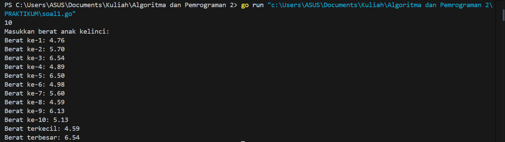

---
<h1 align="center">Laporan Praktikum Modul 10 <br>Pencarian Nilai Ekstrim Pada Himpunan Data </h1>

<p align="center">Tri Setyono Martyantoro - 103112400279</p>
<p align="center">S1IF - 12 - 05</p>


---
## Dasar Teori
---
Dalam pemrograman menggunakan bahasa Go (Golang), pencarian juga menjadi bagian penting, khususnya dalam menemukan nilai ekstrim, yaitu nilai maksimum atau minimum dari sekumpulan data yang disimpan dalam slice. Algoritma pencarian nilai ekstrim dalam Go bekerja secara sekuensial dengan memanfaatkan struktur perulangan for untuk membandingkan elemen-elemen slice satu per satu. Proses dimulai dengan mengasumsikan elemen pertama sebagai nilai ekstrim, lalu setiap elemen berikutnya dibandingkan; jika ditemukan nilai yang lebih ekstrem, maka nilai tersebut akan menggantikan nilai sebelumnya. Proses ini berlanjut hingga akhir slice, dan hasil akhirnya adalah nilai ekstrim yang valid.

---
## Soal Latihan Modul 10

---


> 1. Sebuah program digunakan untuk mendata berat anak kelinci yang akan dijual ke pasar. Program ini menggunakan array dengan kapasitas 1000 untuk menampung data berat anak kelinci yang akan dijual. Masukan terdiri dari sekumpulan bilangan, yang mana bilangan pertama adalah bilangan bulat N yang menyatakan banyaknya anak kelinci yang akan ditimbang beratnya. Selanjutnya N bilangan riil berikutnya adalah berat dari anak kelinci yang akan dijual. Keluaran terdiri dari dua buah bilangan riil yang menyatakan berat kelinci terkecil dan terbesar.


```go
package main

import "fmt"

type databerat [1000]float64

func inputberat(n *int, data *databerat) {
    fmt.Scan(n)
    fmt.Println("Masukkan berat anak kelinci:")
    for i := 0; i < *n; i++ {
        fmt.Printf("Berat ke-%d: ", i+1)
        fmt.Scan(&data[i])
    }
}

func nilaiekstrim(data databerat, n int, min *float64, max *float64) {
    *min = data[0]
    *max = data[0]
    for i := 1; i < n; i++ {
        if data[i] < *min {
            *min = data[i]
        }
        if data[i] > *max {
            *max = data[i]
        }
    }
}

func main() {
    var N int
    var berat databerat
    var beratterkecil , beratterbesar float64

    inputberat(&N, &berat)
    nilaiekstrim(berat, N, &beratterkecil, &beratterbesar)
    fmt.Printf("Berat terkecil: %.2f\n", beratterkecil)
    fmt.Printf("Berat terbesar: %.2f\n", beratterbesar)
}
```
### Output Code

Program di atas digunakan untuk menentukan berat terkecil dan terbesar dari sekumpulan anak kelinci yang akan dijual berdasarkan input berat yang dimasukkan oleh pengguna. Algoritma ini terdiri dari dua prosedur utama, yaitu inputberat dan nilaiekstrim. Prosedur inputberat berfungsi untuk membaca jumlah anak kelinci yang akan ditimbang, kemudian meminta pengguna untuk memasukkan berat masing-masing anak kelinci satu per satu. Data berat tersebut disimpan dalam sebuah array bertipe databerat yang memiliki kapasitas maksimum seribu elemen bertipe float64. Setelah seluruh data dimasukkan, program akan memanggil prosedur nilaiekstrim, yang digunakan untuk mencari nilai berat terkecil dan terbesar dari data yang telah tersimpan. Prosedur ini membandingkan satu per satu nilai berat dalam array untuk menemukan nilai minimum dan maksimum yang valid. Setelah proses pencarian selesai, program akan menampilkan hasil berupa berat terkecil dan terbesar dari anak-anak kelinci tersebut dalam format dua angka di belakang koma.

---

>  2.Sebuah program digunakan untuk menentukan tarif ikan yang akan dijual ke pasar. Program dijual. ini menggunakan array dengan kapasitas 1000 untuk menampung data berat ikan yang akan dijual. Masukan terdiri dari dua baris, yang mana baris pertama terdiri dari dua bilangan bulat x dan y. Bilangan x menyatakan banyaknya ikan yang akan dijual, sedangkan y adalah banyaknya ikan yang akan dimasukan ke dalam wadah. Baris kedua terdiri dari sejumlah x bilangan riil yang menyatakan banyaknya ikan yang akan dijual. Keluaran terdiri dari dua baris. Baris pertama adalah kumpulan bilangan riil yang menyatakan total berat ikan di setiap wadah (jumlah wadah tergantung pada nilai x dan y, urutan ikan yang dimasukan ke dalam wadah sesuai urutan pada masukan baris ke-2). Baris kedua adalah sebuah bilangan riil yang menyatakan berat rata-rata ikan di setiap wadah.

```go
package main

import "fmt"

type databeratikan [1000]float64

func inputikan(x *int, y *int, data *databeratikan) {
    fmt.Scan(x, y)
    fmt.Println("Masukkan berat ikan:")
    for i := 0; i < *x; i++ {
        fmt.Printf("Berat ke-%d: ", i+1)
        fmt.Scan(&data[i])
    }
}

func hitungwadah(data databeratikan, x int, y int, totalwadah *[1000]float64, jumlahwadah *int) {
    j := 0
    for i := 0; i < x; i++ {
        totalwadah[j] += data[i]
        if (i+1)%y == 0 {
            j++
        }
    }
    *jumlahwadah = j
    if x%y != 0 {
        *jumlahwadah++
    }
}

func ratarata(totalwadah [1000]float64, jumlahwadah int) float64 {
    var total float64
    for i := 0; i < jumlahwadah; i++ {
        total += totalwadah[i]
    }
    return total / float64(jumlahwadah)
}

func main() {
    var x, y, jumlahwadah int
    var rata float64
    var data databeratikan
    var totalWadah [1000]float64

    inputikan(&x, &y, &data)
    hitungwadah(data, x, y, &totalWadah, &jumlahwadah)
    rata = ratarata(totalWadah, jumlahwadah)

    fmt.Println("\nTotal berat per wadah:")
    for i := 0; i < jumlahwadah; i++ {
        fmt.Printf("Wadah %d: %.2f kg\n", i+1, totalWadah[i])
    }
    fmt.Printf("\nBerat rata-rata per wadah: %.2f kg\n", rata)
}
```
### Output Code

Program di atas digunakan untuk menentukan total berat ikan per wadah dan menghitung berat rata-rata ikan yang akan dijual ke pasar. Program ini terdiri dari 2 prosedur dan 1 fungsi, yaitu prosedur inputikan, prosedur hitungwadah, dan fungsi ratarata. Prosedur inputikan digunakan untuk membaca masukan berupa jumlah ikan yang akan dijual (x) dan kapasitas ikan per wadah (y), kemudian dilanjutkan dengan input berat masing-masing ikan yang disimpan dalam array bertipe databeratikan. Prosedur hitungwadah digunakan untuk menghitung total berat ikan di setiap wadah berdasarkan urutan input. Setiap ikan dimasukkan secara berurutan ke dalam wadah hingga mencapai batas y, kemudian dilanjutkan ke wadah berikutnya. Setelah semua berat ikan dibagi ke dalam wadah, fungsi ratarata digunakan untuk menghitung rata-rata berat dari semua wadah. Fungsi main akan memanggil ketiga prosedur tersebut secara berurutan, kemudian menampilkan hasil berupa total berat ikan untuk setiap wadah serta berat rata-rata dari seluruh wadah.

---

> 3. Pos Pelayanan Terpadu (posyandu) sebagai tempat pelayanan kesehatan perlu mencatat data berat balita (dalam kg). Petugas akan memasukkan data tersebut ke dalam array. Dari data yang diperoleh akan dicari berat balita terkecil, terbesar, dan reratanya. Buatlah program dengan spesifikasi subprogram sebagai berikut:

```
type arrBalita [100]float64

func hitungMinMax(arrBerat arrBalita; bMin, bMax *float64) {
/* I.S. Terdefinisi array dinamis arrBerat
    Proses: Menghitung berat minimum dan maksimum dalam array
    F.S. Menampilkan berat minimum dan maksimum balita */
...
}

function rerata (arrBerat arrBalita) real {
/* menghitung dan mengembalikan rerata berat balita dalam array */
    ...
}
```

Perhatikan sesi interaksi pada contoh berikut ini <u>**(teks bergaris bawah adalah input/read)**</u>

```
Masukan banyak data berat balita : 4
Masukan berat balita ke-1: 5.3
Masukan berat balita ke-2: 6.2
Masukan berat balita ke-3: 4.1
Masukan berat balita ke-4: 9.9
Berat balita minimum: 4.10 kg
Berat balita maksimum: 9.90 kg
Rerata berat balita: 6.38 kg
```

```go
package main
import "fmt"

type arrBalita [100]float64

func hitungMinMax(arrBerat arrBalita, jumlah int, bMin, bMax *float64) {
    *bMin = arrBerat[0]
    *bMax = arrBerat[0]
    for i := 1; i < jumlah; i++ {
        if arrBerat[i] < *bMin {
            *bMin = arrBerat[i]
        }
        if arrBerat[i] > *bMax {
            *bMax = arrBerat[i]
        }
    }
}

func rerata(arrBerat arrBalita, jumlah int) float64 {
    var total float64
    for i := 0; i < jumlah; i++ {
        total += arrBerat[i]
    }
    return total / float64(jumlah)
}

func main() {
    var jumlah int
    var beratBalita arrBalita
    var bMin, bMax, ratarata float64

    fmt.Print("Masukan banyak data berat balita: ")
    fmt.Scan(&jumlah)
    for i := 0; i < jumlah; i++ {
        fmt.Printf("Masukan berat balita ke-%d: ", i+1)
        fmt.Scan(&beratBalita[i])
    }

    hitungMinMax(beratBalita,jumlah, &bMin, &bMax)
    ratarata = rerata(beratBalita, jumlah)

    fmt.Printf("Berat balita minimum: %.2f kg\n", bMin)
    fmt.Printf("Berat balita maksimum: %.2f kg\n", bMax)
    fmt.Printf("Rerata berat balita: %.2f kg\n", ratarata)
}
```
### Output Code

Program di atas digunakan untuk menentukan berat terkecil, terbesar, dan rata-rata dari sekumpulan data berat balita yang dimasukkan oleh pengguna. Algoritma ini terdiri dari satu prosedur , yaitu hitungMinMax, dan satu fungsi, yaitu rerata. Prosedur hitungMinMax digunakan untuk mencari berat balita terkecil dan terbesar. Prosedur ini menerima parameter array yang berisi data berat balita dan dua pointer untuk menyimpan nilai minimum dan maksimum yang ditemukan. Dalam prosedur ini, seluruh data berat balita dibandingkan satu per satu untuk menemukan nilai terkecil dan terbesar. Fungsi rerata digunakan untuk menghitung nilai rata-rata berat balita dengan cara menjumlahkan seluruh elemen dalam array dan membaginya dengan jumlah data yang dimasukkan oleh pengguna. Setelah itu, program akan menampilkan hasil berupa berat balita terkecil, terbesar, dan rata-rata, masing-masing dalam format dua angka di belakang koma.

---


