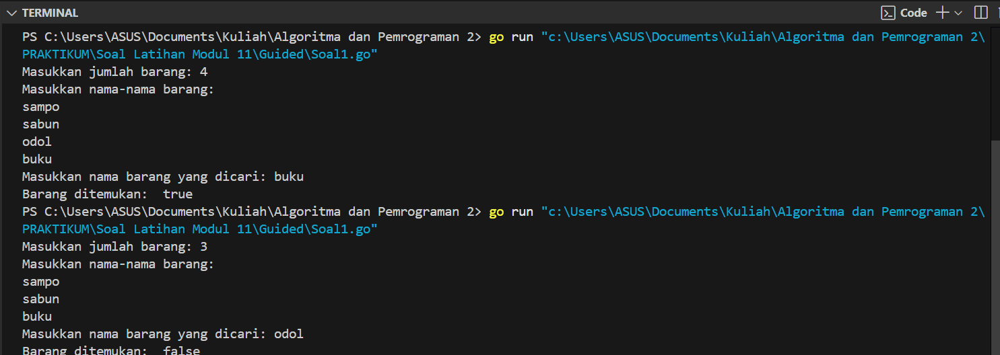

---
<h1 align="center">Laporan Praktikum Modul 11 <br>Pencarian Nilai Acak Pada Himpunan Data </h1>

<p align="center">Tri Setyono Martyantoro - 103112400279</p>
<p align="center">S1IF - 12 - 05</p>


---
## Dasar Teori
---
Dalam dunia pemrograman, pencarian data merupakan proses penting yang digunakan untuk menemukan data spesifik dalam suatu struktur data seperti array. Dua algoritma pencarian yang umum digunakan adalah _Sequential Search_ dan _Binary Search_. _Sequential Search_ atau pencarian sekuensial bekerja dengan cara memeriksa setiap elemen dari awal hingga akhir secara berurutan sampai data yang dicari ditemukan atau semua data telah diperiksa, sehingga cocok digunakan meskipun data tidak terurut. Sebaliknya, _Binary Search_ adalah metode pencarian yang lebih efisien namun mengharuskan data dalam keadaan terurut. Algoritma ini bekerja dengan membandingkan elemen tengah dengan nilai yang dicari dan kemudian mempersempit ruang pencarian ke kiri atau kanan, tergantung pada hasil perbandingan tersebut. Dalam penggunaannya, pencarian tidak hanya berlaku pada tipe data dasar, tetapi juga dapat diterapkan pada array bertipe struct, dengan catatan bahwa keterurutan data harus sesuai dengan field yang menjadi dasar pencarian, khususnya dalam _Binary Search_.

---
## Guided
---
### Soal 1
---

```go
package main
import "fmt"

func cariBarang(daftar []string, x string) bool {
    for _, barang := range daftar {
        if barang == x {
            return true
        }
    }
    return false
}

func main() {
    var n int
    fmt.Print("Masukkan jumlah barang: ")
    fmt.Scan(&n)

    daftarBarang := make([]string, n)
    fmt.Println("Masukkan nama-nama barang:")
    for i := 0; i < n; i++ {
        fmt.Scan(&daftarBarang[i])
    }

    var barangDicari string
    fmt.Print("Masukkan nama barang yang dicari: ")
    fmt.Scan(&barangDicari)
    ditemukan := cariBarang(daftarBarang, barangDicari)
    fmt.Println(ditemukan)
}
```
### Output Code

Program di atas digunakan untuk menentukan apakah sebuah barang tertentu terdapat dalam daftar barang yang dimasukkan oleh pengguna. Algoritma ini terdiri dari dua bagian utama, yaitu proses input data barang dan fungsi pencarian cariBarang. Proses input dilakukan pada fungsi `main`, di mana program pertama-tama meminta pengguna untuk memasukkan jumlah barang, lalu menginput nama-nama barang satu per satu yang kemudian disimpan dalam sebuah array bertipe string. Setelah semua data barang dimasukkan, pengguna diminta untuk memasukkan nama barang yang ingin dicari. Fungsi cariBarang kemudian dipanggil untuk melakukan pencarian secara sekuensial dengan membandingkan setiap elemen dalam array dengan barang yang dicari. Jika barang ditemukan, fungsi akan mengembalikan nilai true; sebaliknya, jika tidak ditemukan, nilai yang dikembalikan adalah false.

---
### Soal 2
---

```go
package main
import "fmt"

func seqSearch(kalimat string, karakter string) []int {
    var posisi []int
    for i := 0; i < len(kalimat); i++ {
        if kalimat[i] == karakter[0] {
            posisi = append(posisi, i)
        }
    }
    return posisi
}

func main() {
    var kalimat, karakter string

    fmt.Print("Kalimat: ")
    fmt.Scan(&kalimat)

    fmt.Print("Karakter: ")
    fmt.Scan(&karakter)

    posisi := seqSearch(kalimat, karakter)
    if len(posisi) > 0 {
        fmt.Println("Posisi huruf", karakter, "dalam kalimat:", posisi)
    } else {
        fmt.Println("Karakter", karakter, "tidak ditemukan dalam kalimat.")
    }
}
```
### Output Code

Program di atas digunakan untuk mencari semua posisi kemunculan sebuah karakter dalam sebuah kalimat yang dimasukkan oleh pengguna. Program ini terdiri dari dua bagian utama, yaitu fungsi seqSearch dan fungsi main. Fungsi main akan meminta pengguna untuk memasukkan sebuah kalimat dan karakter yang ingin dicari, lalu memanggil fungsi seqSearch. Fungsi seqSearch melakukan pencarian berurutan (sequential search) dengan memeriksa setiap karakter dalam kalimat dan menyimpan posisi (indeks) karakter yang sesuai dalam array posisi. Setelah pencarian selesai, program akan menampilkan semua indeks di mana karakter ditemukan, atau jika karakter tidak ada dalam kalimat, program akan memberitahukan bahwa karakter tersebut tidak ditemukan.

---
### Soal 3
---

```go
package main
import "fmt"

type Mahasiswa struct {
    NIM  string
    Nama string
}

func binarySearch(mahasiswa []Mahasiswa, target string) int {
    left := 0
    right := len(mahasiswa) - 1

    for left <= right {
        mid := left + (right-left)/2
        if mahasiswa[mid].NIM == target {
            return mid
        }

        if mahasiswa[mid].NIM > target {
            right = mid - 1
        } else {
            left = mid + 1
        }
    }
    return -1
}

func main() {
    mahasiswa := []Mahasiswa{
        {Nama: "Andi", NIM: "220001"},
        {Nama: "Budi", NIM: "220002"},
        {Nama: "Citra", NIM: "220003"},
        {Nama: "Dina", NIM: "220004"},
    }

    x := "220003"
    index := binarySearch(mahasiswa, x)

    if index != -1 {
        fmt.Println("Indeks Mahasiswa ditemukan: ",index)
    } else {
        fmt.Println("NIM tidak ditemukan.")
    }
}
```
### Output Code

Program di atas digunakan untuk mencari indeks mahasiswa berdasarkan NIM yang terurut menggunakan algoritma binary search. Program ini menyimpan data mahasiswa dalam bentuk slice yang terdiri dari nama dan NIM, kemudian mencari apakah NIM tertentu ada dalam data tersebut. Jika ditemukan, program akan mengembalikan indeks mahasiswa tersebut, dan jika tidak, program akan menampilkan pesan bahwa NIM tersebut tidak ada. Algoritma binary search digunakan untuk mempercepat pencarian dengan membagi data menjadi dua bagian, memeriksa nilai tengah, dan menyesuaikan pencarian ke bagian kiri atau kanan sesuai kebutuhan.

---
## Unguided
---
### Soal 1
---

> 1. Pada pemilihan ketua RT yang baru saja berlangsung, terdapat 20 calon ketua yang bertanding memperebutkan suara warga. Perhitungan suara dapat segera dilakukan karena warga cukup mengisi formulir dengan nomor dari calon ketua RT yang dipilihnya. Seperti biasa, selalu ada pengisian yang tidak tepat atau dengan nomor pilihan di luar yang tersedia, sehingga data juga harus divalidasi. Tugas Anda untuk membuat program mencari siapa yang memenangkan pemilihan ketua RT. Buatlah program pilkart yang akan membaca, memvalidasi, dan menghitung suara yang diberikan dalam pemilihan ketua RT tersebut. Masukan hanya satu baris data saja, berisi bilangan bulat valid yang kadang tersisipi dengan data tidak valid. Data valid adalah integer dengan nilai di antara 1 s.d. 20 (inklusif). Data berakhir jika ditemukan sebuah bilangan dengan nilai 0. Keluaran dimulai dengan baris berisi jumlah data suara yang terbaca, diikuti baris yang berisi berapa banyak suara yang valid. Kemudian sejumlah baris yang mencetak data para calon apa saja yang mendapatkan suara.

<table style="width:100%; border-collapse: collapse; border: 1px solid #fff;">
  <thead>
    <tr>
      <th style="width:5%; border: 1px solid #fff;">No</th>
      <th style="width:45%; border: 1px solid #fff;">Masukan</th>
      <th style="width:50%; border: 1px solid #fff;">Keluaran</th>
    </tr>
  </thead>
  <tbody>
    <tr>
      <td style="border: 1px solid #fff;">1</td>
      <td style="border: 1px solid #fff;">7 19 3 2 78 3 1 -3 18 19 0</td>
      <td style="border: 1px solid #fff;">
        Suara masuk: 10<br>
        Suara sah: 8<br><br>
        1: 1<br>
        2: 1<br>
        3: 2<br>
        7: 1<br>
        18: 1<br>
        19: 2
      </td>
    </tr>
  </tbody>
</table>


```go
package main
import "fmt"

const calonKetua = 20

func inputSuara() []int {
    var suara int
    var input []int

    fmt.Println("Masukkan nomor calon (akhiri dengan 0):")
    for {
        fmt.Scan(&suara)
        if suara == 0 {
            break
        }
        input = append(input, suara)
    }
    return input
}

func hitungSuara(input []int, perolehan *[]int) int {
    totalSah := 0
    for _, s := range input {
        if s >= 1 && s <= calonKetua {
            (*perolehan)[s]++
            totalSah++
        }
    }
    return totalSah
}

func hasilSuara(totalMasuk int, totalSah int, perolehan []int) {
    fmt.Printf("Suara masuk: %d\n", totalMasuk)
    fmt.Printf("Suara sah: %d\n", totalSah)

    for k := 1; k <= calonKetua; k++ {
        if perolehan[k] > 0 {
            fmt.Printf("%d: %d\n", k, perolehan[k])
        }
    }
}

func main() {
    perolehan := make([]int, calonKetua+1)
    input := inputSuara()
    totalMasuk := len(input)
    totalSah := hitungSuara(input, &perolehan)
    hasilSuara(totalMasuk, totalSah, perolehan)
}
```
### Output Code 

Program di atas digunakan untuk menghitung total suara masuk, suara sah, dan perolehan suara masing-masing calon dalam sebuah pemilihan. Program terdiri dari tiga fungsi utama: inputSuara untuk mengumpulkan input suara hingga ditemukan angka 0, hitungSuara untuk memverifikasi dan mencatat suara sah menggunakan pencarian berurutan, dan hasilSuara untuk menampilkan hasil perhitungan. Suara sah dihitung jika nomor calon berada dalam rentang 1–20, dan setiap perolehan dicatat berdasarkan indeks dalam array.

---
### Soal 2
---

> 2. Berdasarkan program sebelumnya, buat program pilkart yang mencari siapa pemenang pemilihan ketua RT. Sekaligus juga ditentukan bahwa wakil ketua RT adalah calon yang mendapatkan suara terbanyak kedua. Jika beberapa calon mendapatkan suara terbanyak yang sama, ketua terpilih adalah dengan nomor peserta yang paling kecil dan wakilnya dengan nomor peserta terkecil berikutnya. Masukan hanya satu baris data saja, berisi bilangan bulat valid yang kadang tersisipi dengan data tidak valid. Data valid adalah bilangan bulat dengan nilai di antara 1 s.d. 20 (inklusif). Data berakhir jika ditemukan sebuah bilangan dengan nilai 0. Keluaran dimulai dengan baris berisi jumlah data suara yang terbaca, diikuti baris yang berisi berapa banyak suara yang valid. Kemudian tercetak calon nomor berapa saja yang menjadi pasangan ketua RT dan wakil ketua RT yang baru.

<table style="border-collapse: collapse; width: 100%;">
  <thead>
    <tr>
      <th style="border: 1px solid #fff; padding: 4px;">No</th>
      <th style="border: 1px solid #fff; padding: 4px;">Masukan</th>
      <th style="border: 1px solid #fff; padding: 4px;">Keluaran</th>
    </tr>
  </thead>
  <tbody>
    <tr>
      <td style="border: 1px solid #fff; padding: 4px;">1</td>
      <td style="border: 1px solid #fff; padding: 4px;">
        7 19 3 2 78 3 1 -3 18 19 0
      </td>
      <td style="border: 1px solid #fff; padding: 4px; white-space: pre-line;">
        Suara masuk: 10<br>
        Suara sah: 8<br>
        Ketua RT: 3<br>
        Wakil ketua: 19
      </td>
    </tr>
  </tbody>
</table>

```go
package main
import "fmt"

const calonKetua = 20

type Kandidat struct {
    Nomor int
    Suara int
}

func inputSuara() []int {
    var suara int
    var input []int

    fmt.Println("Masukkan suara (akhiri dengan 0):")
    for {
        fmt.Scan(&suara)
        if suara == 0 {
            break
        }
        input = append(input, suara)
    }
    return input
}

func hitungSuara(input []int) ([]Kandidat, int, int) {
    totalMasuk := len(input)
    totalSah := 0
    perolehan := make([]int, calonKetua+1)

    for i := 0; i < totalMasuk; i++ {
        s := input[i]
        if s >= 1 && s <= calonKetua {
            perolehan[s]++
            totalSah++
        }
    }

    var daftar []Kandidat
    for i := 1; i <= calonKetua; i++ {
        if perolehan[i] > 0 {
            daftar = append(daftar, Kandidat{Nomor: i, Suara: perolehan[i]})
        }
    }
    return daftar, totalMasuk, totalSah
}

func cariKetuaWakil(daftar []Kandidat) (int, int) {
    var ketua Kandidat
    var wakil Kandidat

    for i := 0; i < len(daftar); i++ {
        c := daftar[i]
        if c.Suara > ketua.Suara || (c.Suara == ketua.Suara && c.Nomor < ketua.Nomor) {
            wakil = ketua
            ketua = c
        } else if c.Suara > wakil.Suara || (c.Suara == wakil.Suara && c.Nomor < wakil.Nomor && c.Nomor != ketua.Nomor) {
            wakil = c
        }
    }
    return ketua.Nomor, wakil.Nomor
}

func main() {
    input := inputSuara()
    daftar, totalMasuk, totalSah := hitungSuara(input)

    fmt.Printf("Suara masuk: %d\n", totalMasuk)
    fmt.Printf("Suara sah: %d\n", totalSah)

    if totalSah > 0 {
        ketua, wakil := cariKetuaWakil(daftar)
        fmt.Printf("Ketua RT: %d\n", ketua)
        if wakil > 0 {
            fmt.Printf("Wakil ketua: %d\n", wakil)
        }
    }
}
```
### Output Code

Program diatas merupakan lanjutan dari soal nomor 1 dan dirancang untuk merekap serta menentukan hasil pemilihan Ketua dan Wakil Ketua RT dari maksimal 20 calon. Proses dimulai dengan meminta pengguna memasukkan deretan suara satu per satu, hingga angka 0 dimasukkan sebagai tanda bahwa input telah selesai. Semua suara yang masuk dihitung sebagai total suara masuk, lalu diproses melalui fungsi hitungSuara untuk memisahkan suara sah yaitu suara dengan nilai antara 1 hingga 20 dan mencatat perolehan suara tiap calon menggunakan struktur data Kandidat. Setelah itu, jumlah suara masuk dan suara sah ditampilkan oleh fungsi tampilkanHasil. Program kemudian melanjutkan dengan menjalankan fungsi cariKetuaWakil guna menentukan calon dengan suara terbanyak sebagai Ketua RT dan suara terbanyak kedua sebagai Wakil Ketua RT, dengan ketentuan bahwa jika ada jumlah suara yang sama, calon dengan nomor lebih kecil akan dipilih terlebih dahulu. Jika terdapat suara sah yang valid, hasil akhir berupa nomor calon ketua dan wakil ketua RT akan ditampilkan sebagai output program.

---
### Soal 3
---

> 3. Diberikan n data integer positif dalam keadaan terurut membesar dan sebuah integer lain k, apakah bilangan k tersebut ada dalam daftar bilangan yang diberikan? Jika ya, berikan indeksnya, jika tidak sebutkan "TIDAK ADA". Masukan terdiri dari dua baris. Baris pertama berisi dua buah integer positif, yaitu n dan k. n menyatakan banyaknya data, dimana 1 < n <= 1000000. k adalah bilangan yang ingin dicari. Baris kedua berisi n buah data integer positif yang sudah terurut membesar. Keluaran terdiri dari satu baris saja, yaitu sebuah bilangan yang menyatakan posisi data yang dicari (k) dalam kumpulan data yang diberikan. Posisi data dihitung dimulai dari angka 0. Atau memberikan keluaran "TIDAK ADA" jika data k tersebut tidak ditemukan dalam kumpulan. Program yang dibangun harus menggunakan subprogram dengan mengikuti kerangka yang sudah diberikan berikut ini.

```
package main
import "fmt"

const NMAX = 1000000
var data [NMAX]int
func main(){
    /* buatlah kode utama yang membaca baris pertama (n dan k). kemudian data
    diisi oleh prosedur isiArray(n), dan pencarian oleh fungsi posisi(n,k), dan
    setelah itu output dicetak. */
func isiArray(n int){
    /* I.S. terdefinisi integer n, dan sejumlah n data sudah siap pada piranti
    masukan.
    F.S. Array data berisi n (<=NMAX) bilangan */
    }
func posisi(n, k int) int {
    /* mengembalikan posisi k dalam array data dengan n elemen. Posisi dimulai
    dari posisi 0. Jika tidak ada kembalikan -1 */
    }
}
```

<table style="border-collapse: collapse; width: 100%;">
  <thead>
    <tr>
      <th style="border: 1px solid #fff; padding: 4px;">No</th>
      <th style="border: 1px solid #fff; padding: 4px;">Masukan</th>
      <th style="border: 1px solid #fff; padding: 4px;">Keluaran</th>
      <th style="border: 1px solid #fff; padding: 4px;">Penjelasan</th>
    </tr>
  </thead>
  <tbody>
    <tr>
      <td style="border: 1px solid #fff; padding: 4px;">1</td>
      <td style="border: 1px solid #fff; padding: 4px;">
        12 534 <br>1 3 8 16 32 123 323 323 534 543 823 999
      </td>
      <td style="border: 1px solid #fff; padding: 4px;">8</td>
      <td style="border: 1px solid #fff; padding: 4px; white-space: pre-line;">
        Data 534 berada pada<br>posisi ke-8 dihitung dari awal data.
      </td>
    </tr>
    <tr>
      <td style="border: 1px solid #fff; padding: 4px;">2</td>
      <td style="border: 1px solid #fff; padding: 4px;">
        12 535 <br>1 3 8 16 32 123 323 323 534 543 823 999
      </td>
      <td style="border: 1px solid #fff; padding: 4px;">TIDAK ADA</td>
      <td style="border: 1px solid #fff; padding: 4px;"></td>
    </tr>
  </tbody>
</table>

```go
package main
import "fmt"

const NMAX = 1000000
var data [NMAX]int

func main() {
    var n, k int
    fmt.Scan(&n, &k)
    isiArray(n)
    pos := posisi(n, k)
    if pos != -1 {
        fmt.Println(pos)
    } else {
        fmt.Println("TIDAK ADA")
    }
}

func isiArray(n int) {
    for i := 0; i < n; i++ {
        fmt.Scan(&data[i])
    }
}

func posisi(n, k int) int {
    low, high := 0, n-1
    for low <= high {
        mid := (low + high) / 2
        if data[mid] == k {
            return mid
        } else if data[mid] < k {
            low = mid + 1
        } else {
            high = mid - 1
        }
    }
    return -1
}
```
### Output Code

Program di atas digunakan untuk mencari posisi sebuah bilangan dalam kumpulan data yang sudah terurut secara menaik. Program terdiri dari tiga bagian utama: prosedur isiArray yang berfungsi untuk membaca n buah data bilangan dari input dan menyimpannya ke dalam array global data, fungsi posisi yang melakukan pencarian posisi bilangan k menggunakan metode pencarian biner untuk efisiensi, dan bagian utama (main) yang mengatur alur input, pemanggilan prosedur dan fungsi, serta menampilkan hasil akhir. Jika bilangan k ditemukan dalam array, maka akan ditampilkan indeksnya (dimulai dari 0), dan jika tidak ditemukan, program akan mencetak "TIDAK ADA".

---


