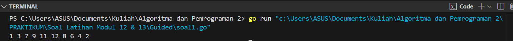
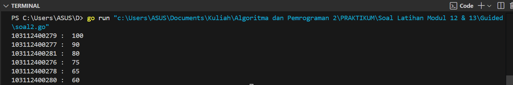
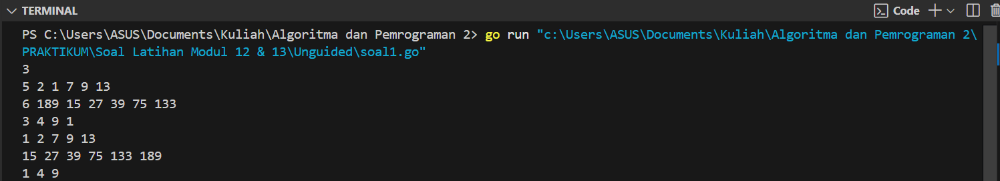
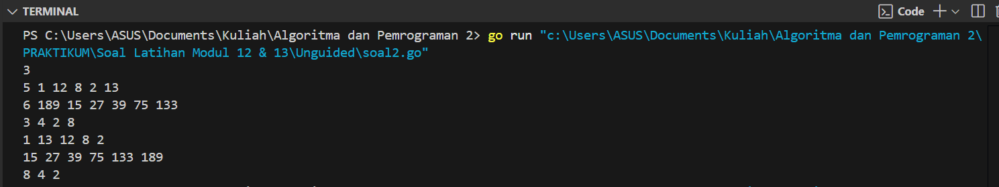
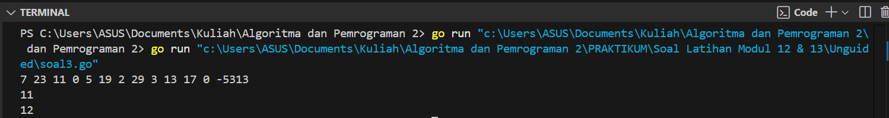
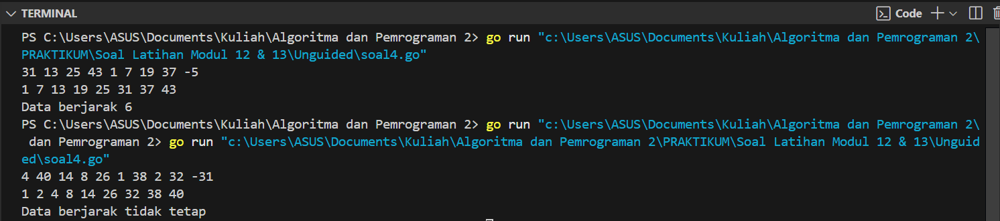
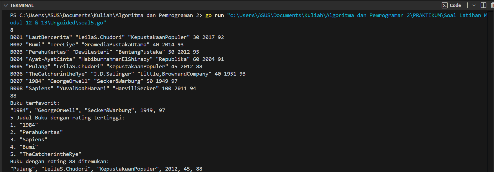

---
<h1 align="center">Laporan Praktikum Modul 12 & 13 <br>Pengurutan Data </h1>

<p align="center">Tri Setyono Martyantoro - 103112400279</p>
<p align="center">S1IF - 12 - 05</p>


---
## Dasar Teori
---
Pengurutan data adalah proses menyusun elemen-elemen berdasarkan urutan tertentu, baik menaik (_ascending_) maupun menurun (_descending_). _Selection Sort_ bekerja dengan mencari nilai ekstrim (terkecil atau terbesar) dari data yang belum terurut, lalu menempatkannya di posisi yang seharusnya melalui proses pertukaran. Proses ini diulang hingga seluruh data terurut. Sebaliknya, _Insertion Sort_ menyisipkan setiap elemen yang belum terurut ke dalam posisi yang tepat di antara data yang sudah terurut dengan cara menggeser elemen-elemen yang lebih besar. Kedua algoritma ini sederhana dan cocok untuk memahami dasar pengurutan data.

---
## Guided
---
### Soal 1
---
### 1. Urut Ganjil Genap

Diberikan `n` bilangan bulat positif. Buat program untuk mengurutkan angka ganjil secara **membesar (ascending)** dan angka genap secara **mengecil (descending)**, lalu gabungkan hasilnya dengan ganjil duluan.

Gunakan **selection sort** dalam proses pengurutan.

**Masukan:**
- Baris pertama berisi bilangan bulat `n` (1 ≤ n ≤ 100).
- Baris kedua berisi `n` bilangan bulat positif.

**Keluaran:**
- Satu baris berisi angka ganjil terurut membesar diikuti angka genap terurut mengecil.

**Contoh Masukan:**

```
10
12 7 3 2 9 6 8 1 11 4
```

**Contoh Keluaran:**

```
1 3 7 9 11 12 8 6 4 2
```

```go
package main
import "fmt"

func selectionSortAsc(arr []int, panjang int) {
    var temp, i, j, idxMin int
    for i = 0; i < panjang-1; i++ {
        idxMin = i
        for j = i + 1; j < panjang; j++ {
            if arr[j] < arr[idxMin] {
                idxMin = j
            }
        }
        temp = arr[idxMin]
        arr[idxMin] = arr[i]
        arr[i] = temp
    }
}

func selectionSortDesc(arr []int, panjang int) {
    var temp, i, j, idxMax int
    for i = 0; i < panjang-1; i++ {
        idxMax = i
        for j = i + 1; j < panjang; j++ {
            if arr[j] > arr[idxMax] {
                idxMax = j
            }
        }
        temp = arr[idxMax]
        arr[idxMax] = arr[i]
        arr[i] = temp
    }
}

func main() {
    n := 10
    numbers := []int{12, 7, 3, 2, 9, 6, 8, 1, 11, 4}

    var ganjil []int
    var genap []int

    for i := 0; i < n; i++ {
        if numbers[i]%2 == 1 {
            ganjil = append(ganjil, numbers[i])
        } else {
            genap = append(genap, numbers[i])
        }
    }
    
    selectionSortAsc(ganjil, len(ganjil))
    selectionSortDesc(genap, len(genap))

    for i := 0; i < len(ganjil); i++ {
        fmt.Print(ganjil[i], " ")
    }
    for i := 0; i < len(genap); i++ {
        fmt.Print(genap[i], " ")
    }
}
```
### Output Code

Program ini digunakan untuk mengurutkan elemen-elemen dalam array berdasarkan kriteria ganjil dan genap. Pertama, program memisahkan bilangan ganjil dan genap dari array numbers dan menyimpannya dalam dua slice terpisah. Selanjutnya, slice bilangan ganjil diurutkan secara menaik menggunakan fungsi selectionSortAsc, sementara slice bilangan genap diurutkan secara menurun dengan fungsi selectionSortDesc. Kedua fungsi tersebut bekerja dengan prinsip _Selection Sort_, di mana nilai minimum (untuk pengurutan menaik) atau maksimum (untuk pengurutan menurun) dicari dan dipindahkan ke posisi yang tepat dalam array. Setelah pengurutan, hasilnya ditampilkan dengan bilangan ganjil terlebih dahulu, diikuti oleh bilangan genap yang sudah terurut.

---
### Soal 2
---
### 2. Ranking Nilai Ujian

Sebuah kelas memiliki sejumlah siswa yang telah mengikuti ujian. Tugas Anda adalah membuat program yang membaca nilai-nilai ujian siswa dengan struct berisikan `nim` dan `nilai`, lalu mengurutkannya dari yang tertinggi ke yang terendah menggunakan **insertion sort**.

**Masukan:**
- Baris pertama adalah sebuah bilangan bulat `n` (1 ≤ n ≤ 100), menyatakan jumlah siswa.
- Baris berikutnya berisi `n` bilangan bulat yang masing-masing adalah nilai ujian (0–100).

**Keluaran:**
- Satu baris berisi nilai-nilai yang sudah terurut dari terbesar ke terkecil.

**Contoh Masukan:**

```
6
75 60 90 80 100 65
```

**Contoh Keluaran:**
```
100 90 80 75 65 60
```

```go
package main
import "fmt"

type identitas struct {
    nim string
    nilai int
}

func insertionSort(arr []identitas) {
    var temp identitas
    for i := 1; i < len(arr); i++ {
        temp = arr[i]
        j := i

        for j > 0 && temp.nilai > arr[j-1].nilai {
            arr[j] = arr[j-1]
            j--
        }
        arr[j] = temp
    }
}

func main() {
    nilai := []identitas{
        {"103112400276", 75},
        {"103112400277", 90},
        {"103112400278", 65},
        {"103112400279", 100},
        {"103112400280", 60},
        {"103112400281", 80},
    }

    insertionSort(nilai)

    for i := 0; i < len(nilai); i++ {
        fmt.Println(nilai[i].nim, ": ", nilai[i].nilai)
    }
}
```
### Output Code

Program di atas digunakan untuk mengurutkan data berupa nim dan nilai dalam slice nilai. Setiap elemen dalam slice adalah sebuah struct identitas yang terdiri dari dua field: nim (string) dan nilai (integer). Fungsi insertionSort digunakan untuk mengurutkan array nilai berdasarkan nilai secara menurun (descending). Proses pengurutan dimulai dengan memilih elemen kedua hingga akhir, lalu mencari posisi yang tepat di bagian yang sudah terurut dengan cara membandingkan nilai elemen yang sedang diproses dengan elemen-elemen sebelumnya. Jika nilai elemen yang sedang diproses lebih besar, elemen-elemen sebelumnya digeser ke kanan hingga ditemukan posisi yang sesuai untuk elemen tersebut. Setelah pengurutan selesai, program mencetak nim dan nilai dari setiap elemen dalam array yang telah terurut.

---
## Unguided
---
### Soal Latihan Selection Sort
---

> 1. Hercules, preman terkenal seantero ibukota, memiliki kerabat di banyak daerah. Tentunya Hercules sangat suka mengunjungi semua kerabatnya itu. Diberikan masukan nomor rumah dari semua kerabatnya di suatu daerah, buatlah program rumahkerabat yang akan menyusun nomor-nomor rumah kerabatnya secara terurut membesar menggunakan algoritma selection sort. Masukan dimulai dengan sebuah integer 𝒏 (0 < n < 1000), banyaknya daerah kerabat Hercules tinggal. Isi 𝒏 baris berikutnya selalu dimulai dengan sebuah integer 𝒎 (0 < m < 1000000) yang menyatakan banyaknya rumah kerabat di daerah tersebut, diikuti dengan rangkaian bilangan bulat positif, nomor rumah para kerabat. Keluaran terdiri dari n baris, yaitu rangkaian rumah kerabatnya terurut membesar di masing masing daerah.

<table border="1" cellpadding="5" cellspacing="0" style="border-collapse: collapse; width: 100%;">
  <tr>
    <th style="text-align: center; vertical-align: middle;">No</th>
    <th style="text-align: center; vertical-align: middle;">Masukan</th>
    <th style="text-align: center; vertical-align: middle;">Keluaran</th>
  </tr>
  <tr>
    <td style="text-align: center;">1</td>
    <td>
      3<br>
      5 2 1 7 9 13<br>
      6 189 15 27 39 75 133<br>
      3 4 9 1
    </td>
    <td>
      1 2 7 9 13<br>
      15 27 39 75 133 189<br>
      1 4 9
    </td>
  </tr>
</table>


```go
package main
import "fmt"

func selectionSort(arr []int) {
    var temp, i, j, idxMin int
    for i = 0; i < len(arr)-1; i++ {
        idxMin = i
        for j = i + 1; j < len(arr); j++ {
            if arr[j] < arr[idxMin] {
                idxMin = j
            }
        }
        temp = arr[idxMin]
        arr[idxMin] = arr[i]
        arr[i] = temp
    }
}

func main() {
    var n, m int
    fmt.Scan(&n)
    
    semuaDaerah:= make([][]int, n)

    for i := 0; i < n; i++ {
        fmt.Scan(&m)
        rumah := make([]int, m)

        for j := 0; j < m; j++ {
            fmt.Scan(&rumah[j])
        }

        selectionSort(rumah)
        semuaDaerah[i] = rumah
    }

    for i := 0; i < len(semuaDaerah); i++ {
        for j := 0; j < len(semuaDaerah[i]); j++ {
            fmt.Print(semuaDaerah[i][j], " ")
        }
        fmt.Println()
    }
}
```
### Output Code 

Program di atas digunakan untuk mengurutkan nomor rumah kerabat Hercules di beberapa daerah secara membesar (ascending) menggunakan algoritma Selection Sort. Program dimulai dengan membaca jumlah daerah n. Untuk setiap daerah, program membaca jumlah rumah m dan kemudian membaca m nomor rumah yang disimpan dalam slice rumah. Setelah itu, slice tersebut diurutkan menggunakan fungsi selectionSort, lalu disimpan ke dalam slice dua dimensi semuaDaerah. Setelah semua data diproses, program mencetak hasil pengurutan tiap daerah satu per satu, di mana setiap baris merupakan nomor rumah yang telah diurutkan dari kecil ke besar untuk satu daerah. Struktur slice dua dimensi digunakan untuk menyimpan hasil pengurutan dari masing-masing daerah sebelum ditampilkan di akhir.

---

> 2. Belakangan diketahui ternyata Hercules itu tidak berani menyeberang jalan, maka selalu diusahakan agar hanya menyeberang jalan sesedikit mungkin, hanya diujung jalan. Karena nomor rumah sisi kiri jalan selalu ganjil dan sisi kanan jalan selalu genap, maka buatlah program kerabat dekat yang akan menampilkan nomor rumah mulai dari nomor yang ganjil lebih dulu terurut membesar dan kemudian menampilkan nomor rumah dengan nomor genap terurut mengecil. Format Masukan masih persis sama seperti sebelumnya. Keluaran terdiri dari n baris, yaitu rangkaian rumah kerabatnya terurut membesar untuk nomor ganjil, diikuti dengan terurut mengecil untuk nomor genap, di masing-masing daerah.

<table border="1" cellpadding="5" cellspacing="0" style="border-collapse: collapse; width: 100%;">
  <tr>
    <th style="text-align: center; vertical-align: middle;">No</th>
    <th style="text-align: center; vertical-align: middle;">Masukan</th>
    <th style="text-align: center; vertical-align: middle;">Keluaran</th>
  </tr>
  <tr>
    <td style="text-align: center;">1</td>
    <td>
      3<br>
      5 2 1 7 9 13<br>
      6 189 15 27 39 75 133<br>
      3 4 9 1
    </td>
    <td>
      1 13 12 8 2<br>
      15 27 39 75 133 189<br>
      8 4 2
    </td>
  </tr>
</table>

```go
package main
import "fmt"

func selectionSortAsc(arr []int) {
    var i, j, minIdx, temp int
    for i = 0; i < len(arr)-1; i++ {
        minIdx = i
        for j = i + 1; j < len(arr); j++ {
            if arr[j] < arr[minIdx] {
                minIdx = j
            }
        }
        temp = arr[i]
        arr[i] = arr[minIdx]
        arr[minIdx] = temp
    }
}

func selectionSortDesc(arr []int) {
    var i, j, maxIdx, temp int
    for i = 0; i < len(arr)-1; i++ {
        maxIdx = i
        for j = i + 1; j < len(arr); j++ {
            if arr[j] > arr[maxIdx] {
                maxIdx = j
            }
        }
        temp = arr[i]
        arr[i] = arr[maxIdx]
        arr[maxIdx] = temp
    }
}

func prosesDaerah(m int) []int {
    var i int
    var rumah []int = make([]int, m)
    var ganjil, genap []int

    for i = 0; i < m; i++ {
        fmt.Scan(&rumah[i])
    }

    for i = 0; i < m; i++ {
        if rumah[i]%2 == 1 {
            ganjil = append(ganjil, rumah[i])
        } else {
            genap = append(genap, rumah[i])
        }
    }

    selectionSortAsc(ganjil)
    selectionSortDesc(genap)

    var hasil []int = append(ganjil, genap...)
    return hasil
}

func cetakHasil(hasil [][]int) {
    var i, j int
    for i = 0; i < len(hasil); i++ {
        for j = 0; j < len(hasil[i]); j++ {
            fmt.Print(hasil[i][j], " ")
        }
        fmt.Println()
    }
}

func main() {
    var n, i, m int
    var hasil [][]int

    fmt.Scan(&n)

    for i = 0; i < n; i++ {
        fmt.Scan(&m)
        hasil = append(hasil, prosesDaerah(m))
    }
    cetakHasil(hasil)
}
```
### Output Code

Program di atas merupakan program yang digunakan untuk membantu Hercules mengurutkan nomor rumah kerabatnya di beberapa daerah berdasarkan aturan khusus: nomor rumah ganjil ditampilkan terlebih dahulu secara urut membesar, kemudian diikuti dengan nomor rumah genap secara urut mengecil. Program ini terdiri dari tiga prosedur dan satu fungsi, yaitu selectionSort dan selectionSortDescending yang merupakan prosedur untuk mengurutkan array secara ascending dan descending, serta cetakHasil yang merupakan prosedur untuk mencetak hasil akhir. Sementara itu, fungsi prosesDaerah mengembalikan hasil pengolahan nomor rumah di satu daerah setelah dipisah dan diurutkan. Di dalam main, program membaca jumlah daerah, lalu untuk setiap daerah, membaca jumlah rumah dan nomornya, lalu memanggil prosesDaerah untuk diproses. Hasil dari setiap daerah disimpan ke dalam slice dua dimensi, dan seluruh hasil ditampilkan sekaligus setelah semua data selesai diproses.

---

> 3. Kompetisi pemrograman yang baru saja berlalu diikuti oleh 17 tim dari berbagai perguruan tinggi ternama. Dalam kompetisi tersebut, setiap tim berlomba untuk menyelesaikan sebanyak mungkin problem yang diberikan. Dari 13 problem yang diberikan, ada satu problem yang menarik. Problem tersebut mudah dipahami, hampir semua tim mencoba untuk menyelesaikannya, tetapi hanya 3 tim yang berhasil. Apa sih problemnya? "Median adalah nilai tengah dari suatu koleksi data yang sudah terurut. Jika jumlah data genap, maka nilai median adalah rerata dari kedua nilai tengahnya. Pada problem ini, semua data merupakan bilangan bulat positif, dan karenanya rerata nilai tengah dibulatkan ke bawah." Buatlah program median yang mencetak nilai median terhadap seluruh data yang sudah terbaca, jika data yang dibaca saat itu adalah 0. Masukan berbentuk rangkaian bilangan bulat. Masukan tidak akan berisi lebih dari 1000000 data, tidak termasuk bilangan 0. Data 0 merupakan tanda bahwa median harus dicetak, tidak termasuk data yang dicari mediannya. Data masukan diakhiri dengan bilangan bulat -5313. Keluaran adalah median yang diminta, satu data per baris.

<table border="1" cellpadding="5" cellspacing="0" style="border-collapse: collapse; width: 100%;">
  <tr>
    <th style="text-align: center; vertical-align: middle;">No</th>
    <th style="text-align: center; vertical-align: middle;">Masukan</th>
    <th style="text-align: center; vertical-align: middle;">Keluaran</th>
  </tr>
  <tr>
    <td style="text-align: center; vertical-align: middle;">1</td>
    <td style="text-align: center; vertical-align: middle;">
      7 23 11 0 5 19 2 29 3 13 17 0 -5313
    </td>
    <td style="text-align: center; vertical-align: middle;">
      11<br>
      12
    </td>
  </tr>
</table>

> Keterangan: Sampai bilangan 0 yang pertama, data terbaca adalah 7 23 11, setelah tersusun: 7 11 23, maka median saat itu adalah 11.
> Petunjuk: Untuk setiap data bukan 0 (dan bukan marker -5313541) simpan ke dalam array, Dan setiap kali menemukan bilangan 0, urutkanlah data yang sudah tersimpan dengan menggunakan metode insertion sort dan ambil mediannya.

```go
package main 
import "fmt"

func selectionSort(arr []int) {
    var i, j, minIdx, temp int
    for i = 0; i < len(arr)-1; i++ {
        minIdx = i
        for j = i + 1; j < len(arr); j++ {
            if arr[j] < arr[minIdx] {
                minIdx = j
            }
        }
        temp = arr[i]
        arr[i] = arr[minIdx]
        arr[minIdx] = temp
    }
}

func hitungMedian(data []int) int {
    var n, tengah, median int
    n = len(data)

    selectionSort(data)

    if n%2 == 1 {
        tengah = n / 2
        median = data[tengah]
    } else {
        tengah = n / 2
        median = (data[tengah-1] + data[tengah]) / 2
    }
    return median
}

func main() {
    var input int
    var data []int
    var salinan []int
    var hasil int

    for {
        fmt.Scan(&input)
        if input == -5313 {
            break
        } else if input == 0 {
            if len(data) > 0 {
                salinan = make([]int, len(data))
                copy(salinan, data)
                hasil = hitungMedian(salinan)
                fmt.Println(hasil)
            }
        } else {
            data = append(data, input)
        }
    }
}
```
### Output Code

Program diatas digunakan untuk menghitung nilai **median** dari kumpulan bilangan bulat positif yang dibaca secara bertahap dari input. Median dihitung setiap kali ditemukan angka **0** dalam input, dan data dihentikan dengan tanda akhir berupa -5313. Program ini terdiri dari dua prosedur yaitu selectionSort dan main, serta satu fungsi yaitu hitungMedian. Alur program dimulai dari fungsi main, di mana setiap bilangan yang dibaca akan disimpan dalam array data. Jika bilangan tersebut adalah 0, maka program akan membuat salinan dari data yang sudah masuk lalu memanggil fungsi hitungMedian untuk menghitung median-nya. Fungsi hitungMedian menggunakan prosedur selectionSort untuk mengurutkan data terlebih dahulu, kemudian menghitung median sesuai dengan panjang data  jika ganjil, median adalah elemen tengah; jika genap, median adalah rata-rata dari dua elemen tengah (dibulatkan ke bawah karena integer). Setelah median ditemukan, hasilnya dicetak ke layar. Proses terus berulang sampai ditemukan bilangan -5313 yang menandakan akhir dari input.

---
### Soal Latihan Insertion Sort
---

> 1. Buatlah sebuah program yang digunakan untuk membaca data integer seperti contoh yang diberikan di bawah ini, kemudian diurutkan (menggunakan metoda insertion sort), dan memeriksa apakah data yang terurut berjarak sama terhadap data sebelumnya. Masukan terdiri dari sekumpulan bilangan bulat yang diakhiri oleh bilangan negatif. Hanya bilangan non negatif saja yang disimpan ke dalam array. Keluaran terdiri dari dua baris. Baris pertama adalah isi dari array setelah dilakukan pengurutan, sedangkan baris kedua adalah status jarak setiap bilangan yang ada di dalam array. "Data berjarak x" atau "data berjarak tidak tetap".

<table border="1" cellpadding="5" cellspacing="0" style="border-collapse: collapse; width: 100%;">
  <tr>
    <th style="text-align: center; vertical-align: middle;">No</th>
    <th style="text-align: center; vertical-align: middle;">Masukan</th>
    <th style="text-align: center; vertical-align: middle;">Keluaran</th>
  </tr>
  <tr>
    <td style="text-align: center;">1</td>
    <td style="text-align: center;">31 13 25 43 1 7 19 37 -5</td>
    <td style="text-align: center;">
      1 7 13 19 25 31 37 43<br>
      Data berjarak 6
    </td>
  </tr>
  <tr>
    <td style="text-align: center;">2</td>
    <td style="text-align: center;">4 40 14 8 26 1 38 2 32 -31</td>
    <td style="text-align: center;">
      1 2 4 8 14 26 32 38 40<br>
      Data berjarak tidak tetap
    </td>
  </tr>
</table>

```go
package main 
import "fmt"

func insertionSort(arr []int, panjang int) {
    var i, j, temp int
    for i = 1; i < panjang; i++ {
        temp = arr[i]
        j = i - 1
        for j >= 0 && arr[j] > temp {
            arr[j+1] = arr[j]
            j--
        }
        arr[j+1] = temp
    }
}

func cekJarak(arr []int, panjang int) string {
    var jarak, i int
    if panjang < 2 {
        return "Data berjarak tidak tetap"
    }

    jarak = arr[1] - arr[0]
    for i = 2; i < panjang; i++ {
        if arr[i]-arr[i-1] != jarak {
            return "Data berjarak tidak tetap"
        }
    }
    return fmt.Sprintf("Data berjarak %d", jarak)
}

func main() {
    var data []int
    var input, panjang, i int

    for {
        fmt.Scan(&input)
        if input < 0 {
            break
        }
        data = append(data, input)
    }

    panjang = len(data)
    insertionSort(data, panjang)

    for i = 0; i < panjang; i++ {
        fmt.Print(data[i], " ")
    }
    fmt.Println()

    fmt.Println(cekJarak(data, panjang))
}
```
### Output Code

Program di atas digunakan untuk mengurutkan data bilangan bulat yang dibaca secara bertahap dari input dan memeriksa apakah jarak antar elemen dalam data tersebut tetap. Program ini terdiri dari satu prosedur, yaitu insertionSort, yang digunakan untuk mengurutkan data, dan satu fungsi, yaitu cekJarak, yang berfungsi untuk memeriksa apakah jarak antara elemen-elemen dalam data tetap sama. Alur program dimulai dengan membaca input bilangan yang disimpan dalam slice data, yang akan terus berlanjut hingga ditemukan angka negatif sebagai tanda akhir input. Setelah itu, data yang sudah dibaca akan diurutkan menggunakan prosedur insertionSort, kemudian fungsi cekJarak akan mengecek apakah selisih antara setiap elemen dalam data konsisten. Jika jarak antar elemen tidak tetap, fungsi akan mengembalikan pesan "Data berjarak tidak tetap"; jika tetap, maka jarak antar elemen akan dicetak.

---

> 2. Sebuah program perpustakaan digunakan untuk mengelola data buku di dalam suatu perpustakaan. Misalnya terdefinisi struct dan array seperti berikut ini:

```
const nMax : integer = 7919
type Buku = <  
    id, judul, penulis, penerbit : string
    eksemplar, tahun, rating : integer >
    
type DaftarBuku = array [ 1..nMax] of Buku
Pustaka : DaftarBuku
nPustaka: integer
```

> Masukan terdiri dari beberapa baris. Baris pertama adalah bilangan bulat N yang menyatakan banyaknya data buku yang ada di dalam perpustakaan. N baris berikutnya, masing-masingnya adalah data buku sesuai dengan atribut atau field pada struct. Baris terakhir adalah bilangan bulat yang menyatakan rating buku yang akan dicari. Keluaran terdiri dari beberapa baris. Baris pertama adalah data buku terfavorit, baris kedua adalah lima judul buku dengan rating tertinggi, selanjutnya baris terakhir adalah data buku yang dicari sesuai rating yang diberikan pada masukan baris terakhir. Lengkapi subprogram-subprogram dibawah ini, sesuai dengan I.S. dan F.S yang diberikan.

```
procedure DaftarkanBuku(in/out pustaka : DaftarBuku, n : integer)
    {I.S. sejumlah n data buku telah siap para piranti masukan
    F.S. n berisi sebuah nilai, dan pustaka berisi sejumlah n data buku}
    
procedure CetakTerfavorit(in pustaka : DaftarBuku, in n : integer)
    {I.S. array pustaka berisi n buah data buku dan belum terurut
    F.S. Tampilan data buku (judul, penulis, penerbit, tahun)
    terfavorit, yaitu memiliki rating tertinggi}

procedure UrutBuku( in/out pustaka : DaftarBuku, n : integer )
    {I.S. Array pustaka berisi n data buku
    F.S. Array pustaka terurut menurun/mengecil terhadap rating.
    Catatan: Gunakan metoda Insertion sort}

procedure Cetak5Terbaru( in pustaka : DaftarBuku, n integer )
    {I.S. pustaka berisi n data buku yang sudah terurut menurut rating
    F.S. Laporan 5 judul buku dengan rating tertinggi
    Catatan: Isi pustaka mungkin saja kurang dari 5}

procedure CariBuku(in pustaka : DaftarBuku, n : integer, r : integer )
    {I.S. pustaka berisi n data buku yang sudah terurut menurut rating
    F.S. Laporan salah satu buku (judul, penulis, penerbit, tahun,
    eksemplar, rating) dengan rating yang diberikan. Jika tidak ada buku
    dengan rating yang ditanyakan, cukup tuliskan “Tidak ada buku dengan
    rating seperti itu”. Catatan: Gunakan pencarian biner/belah dua.}
```

```go
package main
import "fmt"

const nMax = 7919

type Buku struct {
    id, judul, penulis, penerbit string
    eksemplar, tahun, rating     int
}

type DaftarBuku [nMax]Buku

func DaftarkanBuku(pustaka *DaftarBuku, n *int) {
    var buku Buku
    var i int
    fmt.Scan(&(*n))
    for i = 0; i < *n; i++ {
        fmt.Scan(&buku.id, &buku.judul, &buku.penulis, &buku.penerbit, &buku.eksemplar, &buku.tahun, &buku.rating)
        (*pustaka)[i] = buku
    }
}

func CetakTerfavorit(pustaka DaftarBuku, n int) {
    var terfavorit Buku
    var i int
    terfavorit = pustaka[0]
    for i = 1; i < n; i++ {
        if pustaka[i].rating > terfavorit.rating {
            terfavorit = pustaka[i]
        }
    }
    fmt.Println("Buku terfavorit:")
    fmt.Printf("%s, %s, %s, %d, %d\n", terfavorit.judul, terfavorit.penulis, terfavorit.penerbit, terfavorit.tahun, terfavorit.rating)
}

func UrutBuku(pustaka *DaftarBuku, n int) {
    var i, j int
    var temp Buku
    for i = 1; i < n; i++ {
        temp = (*pustaka)[i]
        j = i - 1
        for j >= 0 && (*pustaka)[j].rating < temp.rating {
            (*pustaka)[j+1] = (*pustaka)[j]
            j--
        }
        (*pustaka)[j+1] = temp
    }
}

func Cetak5Terbaru(pustaka DaftarBuku, n int) {
    var i int
    if n > 5 {
        n = 5
    }
    fmt.Println("5 Judul Buku dengan rating tertinggi:")
    for i = 0; i < n; i++ {
        fmt.Printf("%d. %s\n", i+1, pustaka[i].judul)
    }
}

func CariBuku(pustaka DaftarBuku, n int, r int) {
    var kiri, kanan, tengah int
    var ditemukan bool
    kiri = 0
    kanan = n - 1
    ditemukan = false
    for kiri <= kanan {
        tengah = (kiri + kanan) / 2
        if pustaka[tengah].rating == r {
            fmt.Printf("Buku dengan rating %d ditemukan:\n", r)
            fmt.Printf("%s, %s, %s, %d, %d, %d\n", pustaka[tengah].judul, pustaka[tengah].penulis, pustaka[tengah].penerbit, pustaka[tengah].tahun, pustaka[tengah].eksemplar, pustaka[tengah].rating)
            ditemukan = true
            break
        } else if pustaka[tengah].rating < r {
            kanan = tengah - 1
        } else {
            kiri = tengah + 1
        }
    }
    if !ditemukan {
        fmt.Println("Tidak ada buku dengan rating seperti itu")
    }
}

func main() {
    var pustaka DaftarBuku
    var nPustaka, ratingCari int

    DaftarkanBuku(&pustaka, &nPustaka)
    fmt.Scan(&ratingCari)
    UrutBuku(&pustaka, nPustaka)
    CetakTerfavorit(pustaka, nPustaka)
    Cetak5Terbaru(pustaka, nPustaka)
    CariBuku(pustaka, nPustaka, ratingCari)
}
```
### Output Code

Program di atas digunakan untuk mengelola data buku dalam sebuah perpustakaan, dengan fitur untuk memasukkan data buku, mengurutkan buku berdasarkan rating tertinggi, menampilkan buku terfavorit, menampilkan lima judul buku dengan rating tertinggi, serta mencari buku berdasarkan rating yang dimasukkan oleh pengguna. Alur program dimulai dari input jumlah buku dan data setiap buku yang meliputi id, judul, penulis, penerbit, jumlah eksemplar, tahun terbit, dan rating. Setelah data masuk, program akan meminta input rating yang ingin dicari. Kemudian, data buku diurutkan berdasarkan rating tertinggi ke terendah menggunakan algoritma insertion sort. Setelah itu, program menampilkan buku terfavorit (yang memiliki rating tertinggi), lalu mencetak lima judul buku dengan rating tertinggi. Terakhir, dilakukan pencarian menggunakan binary search untuk mencari buku dengan rating yang dimasukkan pengguna dan menampilkannya jika ditemukan, atau memberi pesan jika tidak ditemukan.

---


