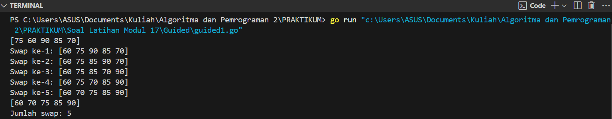
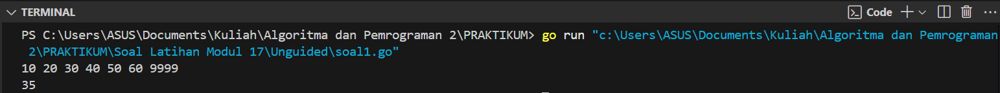
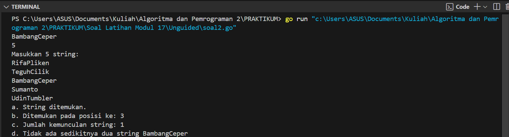
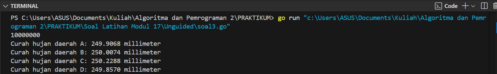
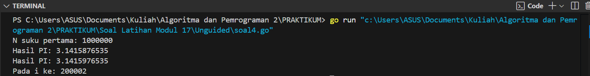
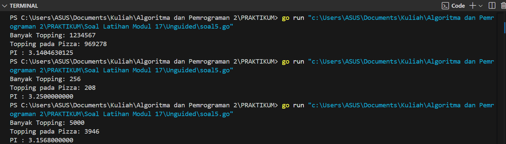

---
<h1 align="center">Laporan Praktikum Modul 17 <br>Skema Pemrosesan Sekuensial </h1>

<p align="center">Tri Setyono Martyantoro - 103112400279</p>
<p align="center">S1IF - 12 - 05</p>


---
## Dasar Teori
---
Skema pemrosesan sekuensial merupakan salah satu dasar penting dalam pemrograman yang digunakan untuk memproses data secara berurutan sesuai urutan masuk atau posisi dalam struktur data, seperti array. Dalam skema ini, data dibaca dan diproses satu per satu menggunakan perulangan, baik hingga mencapai jumlah tertentu maupun sampai menemukan tanda akhir (marker).

---
## Guided
---
### Soal 1
---

> Aldi memiliki daftar nilai ulangan matematika temannya: 75, 60, 90, 85, dan 70. Ia ingin mengurutkan nilai tersebut dari yang terkecil ke yang terbesar menggunakan **metode Bubble Sort**.

> **Pertanyaan:**

> 1. Tunjukkan proses pengurutan nilai menggunakan Bubble Sort **hingga semua nilai terurut.**
> 2. Berapa kali pertukaran (swap) terjadi dalam proses ini?


```go
package main
import "fmt"

func main() {
    nilai := []int{75, 60, 90, 85, 70}
    swapCount := 0

    fmt.Println(nilai)

    n := len(nilai)
    for i := 0; i < n-1; i++ {
        for j := 0; j < n-i-1; j++ {
            if nilai[j] > nilai[j+1] {
                nilai[j], nilai[j+1] = nilai[j+1], nilai[j]
                swapCount++
                fmt.Printf("Swap ke-%d: %v\n", swapCount, nilai)
            }
        }
    }

    fmt.Println(nilai)
    fmt.Printf("Jumlah swap: %d\n", swapCount)
}
```
### Output Code

Program di atas adalah implementasi algoritma Bubble Sort  yang digunakan untuk mengurutkan daftar nilai dari yang terkecil ke yang terbesar. Program dimulai dengan mendeklarasikan sebuah slice bernama nilai yang berisi angka-angka (75, 60, 90, 85, 70), lalu mencetak isi slice tersebut sebelum proses pengurutan. Selanjutnya, dilakukan dua perulangan bersarang: perulangan luar (i) mengatur jumlah pass atau iterasi, sedangkan perulangan dalam (j) membandingkan dua elemen yang berdekatan dan menukarnya jika urutannya salah (nilai di kiri lebih besar dari nilai di kanan). Setiap kali terjadi pertukaran, program mencetak kondisi array terkini dan menambahkan penghitung swapCount untuk mencatat jumlah swap yang terjadi. Setelah seluruh proses selesai, program mencetak hasil akhir dari slice yang sudah terurut serta jumlah total pertukaran yang terjadi.

---
## Unguided
---

> 1. Diberikan sejumlah bilangan real yang diakhiri dengan marker 9999, cari rerata dari bilangan bilangan tersebut.

```go
package main
import "fmt"

func main() {
    var angka, ratarata float64
    var jumlah float64 = 0
    var banyak int = 0

    for {
        fmt.Scan(&angka)
        if angka == 9999 {
            break
        }
        jumlah += angka
        banyak++
    }
    
    if banyak > 0 {
        ratarata = jumlah / float64(banyak)
        fmt.Println(ratarata)
    } else {
        fmt.Println("Tidak ada data untuk dihitung.")
    }
}
```
### Output Code

Program di atas digunakan untuk menghitung rata-rata dari sekumpulan bilangan real yang dibaca hingga ditemukan nilai 9999 sebagai penanda akhir. Program membaca data satu per satu menggunakan perulangan, menjumlahkan semua nilai, dan menghitung banyaknya data. Setelah pembacaan selesai, jika ada data yang masuk, program membagi total jumlah dengan jumlah data untuk mendapatkan rata-rata dan menampilkannya. Jika tidak ada data, program memberi pesan bahwa tidak ada data yang dihitung.

---

> 2. Diberikan string x dan n buah string. x adalah data pertama yang dibaca, n adalah data bilangan yang dibaca kedua, dan n data berikutnya adalah data string. Buat algoritma untuk menjawab pertanyaan berikut:

> a. Apakah string x ada dalam kumpulan n data string tersebut? 
> b. Pada posisi ke berapa string x tersebut ditemukan? 
> c. Ada berapakah string x dalam kumpulan n data string tersebut? 
> d. Adakah sedikitnya dua string x dalam n data string tersebut?

```go
package main
import "fmt"

func inputData() (string, int) {
    var x string
    var n int
    fmt.Scan(&x)
    fmt.Scan(&n)
    return x, n
}

func bacaDataString(n int) []string {
    var data = make([]string, n)
    var i int

    fmt.Println("Masukkan", n, "string:")
    for i = 0; i < n; i++ {
        fmt.Scan(&data[i])
    }
    return data
}

func cariString(data []string, x string) (bool, int, int) {
    var ditemukan bool = false
    var jumlah, posisi, i int
    posisi = -1

    for i = 0; i < len(data); i++ {
        if data[i] == x {
            jumlah++
            if !ditemukan {
                ditemukan = true
                posisi = i + 1
            }
        }
    }
    return ditemukan, posisi, jumlah
}

func tampilkanHasil(x string, ditemukan bool, posisi int, jumlah int) {
    if ditemukan {
        fmt.Println("a. String ditemukan.")
        fmt.Println("b. Ditemukan pada posisi ke:", posisi)
    } else {
        fmt.Println("a. String tidak ditemukan.")
        fmt.Println("b. Tidak ditemukan, jadi tidak ada posisi.")
    }
    fmt.Println("c. Jumlah kemunculan string:", jumlah)
    if jumlah >= 2 {
        fmt.Println("d. Ada sedikitnya dua string", x)
    } else {
        fmt.Println("d. Tidak ada sedikitnya dua string", x)
    }
}

func main() {
    var x string
    var n, posisi, jumlah int
    var data []string
    var ditemukan bool

    x, n = inputData()
    data = bacaDataString(n)
    ditemukan, posisi, jumlah = cariString(data, x)
    tampilkanHasil(x, ditemukan, posisi, jumlah)
}
```
### Output Code

Program di atas dibuat untuk mengecek keberadaan sebuah string tertentu (x) dalam sekumpulan string yang dimasukkan oleh pengguna, lalu menjawab beberapa pertanyaan terkait string tersebut. Pertama, program akan meminta pengguna memasukkan string x yang ingin dicari, lalu memasukkan jumlah data n yang menunjukkan berapa banyak string yang akan dicek. Kemudian, pengguna diminta memasukkan n string yang akan disimpan dalam slice data. Program selanjutnya melakukan pencarian dengan memeriksa setiap elemen dalam slice, menghitung berapa kali string x muncul, serta mencatat posisi pertama kali ditemukan (jika ada). Berdasarkan hasil pencarian, program mencetak apakah string x ditemukan atau tidak, posisi kemunculan pertamanya, jumlah total kemunculannya, dan apakah string tersebut muncul setidaknya dua kali.

---

> 3. Empat daerah A, B, C, dan D yang berdekatan ingin mengukur curah hujan. Keempat daerah tersebut digambarkan pada bidang berikut:

<div style="display: flex; flex-direction: column; align-items: center;">

  <table style="border-collapse: collapse;">
    <tr>
      <td style="background-color: green; width: 50px; height: 50px; text-align: center; vertical-align: middle; color: white;">D</td>
      <td style="background-color: gold; width: 50px; height: 50px; text-align: center; vertical-align: middle; color: white;">C</td>
    </tr>
    <tr>
      <td style="background-color: skyblue; width: 50px; height: 50px; text-align: center; vertical-align: middle; color: white;">A</td>
      <td style="background-color: red; width: 50px; height: 50px; text-align: center; vertical-align: middle; color: white;">B</td>
    </tr>
  </table>

  <p style="margin-top: 10px; font-family: monospace;">
    (0,0) kiri bawah &nbsp;&nbsp;&nbsp; (1,1) kanan atas
  </p>

</div>

> Misal curah hujan dihitung berdasarkan banyaknya tetesan air hujan. Setiap tetesan berukuran 0.0001 ml curah hujan. Tetesan air hujan turun secara acak dari titik (0,0) sampai (1,1). Jika diterima input yang menyatakan banyaknya tetesan air hujan. Tentukan curah hujan untuk keempat daerah tersebut. Buatlah program yang menerima input berupa banyaknya tetesan air hujan. Kemudian buat koordinat/titik (x, y) secara acak dengan menggunakan fungsi rand.Float64(). Hitung dan tampilkan banyaknya tetesan yang jatuh pada daerah A, B, C dan D. Konversikan satu tetesan berukuran 0.0001 milimeter. 
> Catatan: Lihat lampiran untuk informasi menggunakan paket math/rand untuk menggunakan rand.Float64() yang menghasilkan bilangan riil acak [0..1]. Berikut contoh masukan dan keluarannya:

<table border="1" cellpadding="5" cellspacing="0" style="border-collapse: collapse; width: 100%;">
  <tr>
    <th style="text-align: center; vertical-align: middle;">No</th>
    <th style="text-align: center; vertical-align: middle;">Masukan</th>
    <th style="text-align: center; vertical-align: middle;">Keluaran</th>
  </tr>
  <tr>
    <td style="text-align: center;">1</td>
    <td style="text-align: center;">10000000</td>
    <td style="font-family: monospace;">
      Curah hujan daerah A: 250.0066 milimeter<br>
      Curah hujan daerah B: 249.8981 milimeter<br>
      Curah hujan daerah C: 249.9930 milimeter<br>
      Curah hujan daerah D: 250.1023 milimeter
    </td>
  </tr>
</table>

```go
package main
import (
    "fmt"
    "math/rand"
    "time"
)

const tetesanML = 0.0001

func inputJumlahTetes() int {
    var n int
    fmt.Scan(&n)
    return n
}

func hitungTetesanPerDaerah(n int) (int, int, int, int) {
    var i, A, B, C, D int
    var x, y float64

    rand.Seed(time.Now().UnixNano())

    for i = 0; i < n; i++ {
        x = rand.Float64()
        y = rand.Float64()

        if x < 0.5 && y < 0.5 {
            A++
        } else if x >= 0.5 && y < 0.5 {
            B++
        } else if x < 0.5 && y >= 0.5 {
            C++
        } else {
            D++
        }
    }
    return A, B, C, D
}

func tampilkanCurahHujan(A, B, C, D int) {
    fmt.Printf("Curah hujan daerah A: %.4f millimeter\n", float64(A)*tetesanML)
    fmt.Printf("Curah hujan daerah B: %.4f millimeter\n", float64(B)*tetesanML)
    fmt.Printf("Curah hujan daerah C: %.4f millimeter\n", float64(C)*tetesanML)
    fmt.Printf("Curah hujan daerah D: %.4f millimeter\n", float64(D)*tetesanML)
}

func main() {
    var jumlahTetes, A, B, C, D int

    jumlahTetes = inputJumlahTetes()
    A, B, C, D = hitungTetesanPerDaerah(jumlahTetes)
    tampilkanCurahHujan(A, B, C, D)
}
```
### Output Code

Program di atas digunakan untuk mensimulasikan pengukuran curah hujan di empat daerah (A, B, C, dan D) yang terbagi dalam bidang persegi berukuran 1×1, dengan setiap daerah menempati seperempat bagian bidang tersebut. Program meminta input berupa jumlah tetesan air hujan, lalu secara acak menentukan posisi jatuhnya setiap tetesan menggunakan koordinat acak (x, y) dalam rentang [0,1]. Berdasarkan posisi koordinat tersebut, program mengelompokkan tetesan ke salah satu dari empat daerah: A (x<0.5, y<0.5), B (x≥0.5, y<0.5), C (x<0.5, y≥0.5), atau D (x≥0.5, y≥0.5). Setelah semua tetesan diproses, program menghitung curah hujan di masing-masing daerah dengan mengalikan jumlah tetesan dengan 0.0001 ml (volume tiap tetesan), lalu menampilkan hasil curah hujan tersebut dalam satuan millimeter untuk tiap daerah.

---

> 4. Berdasarkan formula Leibniz, nilai π dapat dinyatakan sebagai deret harmonik ganti sebagai berikut:

$$
1 - \frac{1}{3} + \frac{1}{5} - \frac{1}{7} + \frac{1}{9} - \cdots = \frac{\pi}{4}
$$

> Suku ke-i dinyatakan sebagai 𝑆 dan jumlah deret adalah 𝑆. Apabila diketahui suku pertama S1 =1, suku kedua 𝑆 = -1/3 Temukan rumus untuk suku ke-𝒊 atau 𝑆. Berdasarkan rumus tersebut, buatlah program yang menghitung 𝑆 untuk 1000000 suku pertama. Perhatikan contoh sesi interaksi program di bawah ini (teks bergaris bawah adalah input/read):

```
N suku pertama: 1000000
Hasil PI: 3.1415951
```

> Setelah jalan, modifikasi program tersebut agar menyimpan nilai dua suku yang bersebelahan, Si dan 𝑆i+1 . Buatlah agar program tersebut sekarang berhenti apabila selisih dari kedua suku tersebut tidak lebih dari 0.00001. Perhatikan contoh sesi interaksi program di bawah ini (teks bergaris bawah adalah input/read):

```
N suku pertama: 1000000 
Hasil PI: 3.1415876535 
Hasil PI: 3.1415976535 
Pada i ke: 200002
```


```go
package main
import "fmt"

func nilaiAbsolut(x float64) float64 {
    if x < 0 {
        return -x
    }
    return x
}

func potong10(x float64) float64 {
    var hasil float64
    hasil = float64(int64(x * 1e10)) / 1e10
    return hasil
}

func cariPI(n int) (float64, float64, int) {
    var jumlahDeret, suku, selisih float64
    var piSebelumnya, piSekarang float64
    var i int
    var tanda float64 = 1.0

    for i = 0; i < n; i++ {
        suku = tanda / float64(2*i+1)
        jumlahDeret += suku
        piSekarang = jumlahDeret * 4
        
        if i > 0 {
            selisih = nilaiAbsolut(piSekarang - piSebelumnya)
            if selisih < 0.00001 {
                break
            }
        }
        piSebelumnya = piSekarang
        tanda *= -1
    }
    return potong10(piSebelumnya), potong10(piSekarang), i + 2
}

func main() {
    var n, posisi int
    var pi1, pi2 float64

    fmt.Print("N suku pertama: ")
    fmt.Scan(&n)

    pi1, pi2, posisi = cariPI(n)

    fmt.Printf("Hasil PI: %.10f\n", pi1)
    fmt.Printf("Hasil PI: %.10f\n", pi2)
    fmt.Println("Pada i ke:", posisi)
}
```
### Output Code

Program di atas digunakan untuk menghitung nilai pendekatan π (pi) menggunakan deret Leibniz, yaitu suatu deret tak hingga yang disusun dari bilangan ganjil dengan tanda yang bergantian. Program dimulai dengan membaca input berupa jumlah maksimum suku yang ingin dihitung, kemudian dalam fungsi cariPI, deret dihitung satu per satu menggunakan perulangan, dan hasil dikalikan 4 sesuai rumus π = 4 × (1 - 1/3 + 1/5 - 1/7 + ...). Setiap hasil dibandingkan dengan hasil sebelumnya hingga ditemukan dua nilai π berturut-turut yang memiliki selisih kurang dari 0.00001. Kedua nilai tersebut dipotong (bukan dibulatkan) sampai 10 digit desimal dengan fungsi potong10. Setelah ditemukan, nilai π sebelum dan sesudah serta posisi indeks suku keberapa itu terjadi akan ditampilkan.

---

> 5. Monti bekerja pada sebuah kedai pizza, saking ramainya kedai tersebut membuat Monti tidak ada waktu untuk bersantai. Suatu ketika saat sedang menaburkan topping pada pizza yang diletakkan pada wadah berbentuk persegi, terpikirkan oleh Monti cara menghitung berapa banyak topping yang dia butuhkan, dan cara menghitung nilai 𝝅. Ilustrasi seperti gambar yang diberikan di bawah, topping adalah lingkaran-lingkaran kecil. Ada yang tepat berada di atas pizza, dan ada yang jatuh di dalam kotak tetapi berada di luar pizza. Apabila luas pizza yang memiliki radius r adalah 𝐿𝑢𝑎𝑠𝑃𝑖𝑧𝑧𝑎 = 𝜋𝑟 dan luas wadah pizza yang memiliki panjang sisi 𝑑 = 2𝑟 adalah 𝐿𝑢𝑎𝑠𝑊𝑎𝑑𝑎ℎ = 𝑑 = 4𝑟 , maka diperoleh perbandingan luas kedua bidang tersebut

$$
\frac{\textit{LuasPizza}}{\textit{LuasWadah}} = \frac{\pi r^2}{4r^2} = \frac{\pi}{4}
$$

> Persamaan lingkaran adalah (𝑥 − 𝑥) + (𝑦 − 𝑦) = 𝑟 dengan titik pusat lingkaran adalah (𝑥 ,𝑦). Suatu titik sembarang (𝑥,𝑦) dikatakan berada di dalam lingkaran apabila memenuhi ketidaksamaan:

$$
(x - x_c)^2 + (y - y_c)^2 \leq r^2
$$
> Pada ilustrasi topping berbentuk bulat kecil merah dan biru pada gambar adalah titik-titik (𝑥, 𝑦) acak pada sebuah wadah yang berisi pizza. Dengan jumlah yang sangat banyak dan ditaburkan merata (secara acak), maka kita bisa mengetahui berapa banyak titik/topping yang berada tepat di dalam pizza menggunakan ketidaksamaan di atas. Buatlah program yang menerima input berupa banyaknya topping yang akan ditaburkan, kemudian buat titik acak (𝑥, 𝑦) dari bilangan acak riil pada kisaran nilai 0 hingga 1 sebanyak topping yang diberikan. Hitung dan tampilkan berapa banyak topping yang jatuh tepat di atas pizza. Titik pusat pizza adalah (0.5, 0.5) dan jari-jari pizza adalah 0.5 satuan wadah. 
> Perhatikan contoh sesi interaksi program di bawah ini (teks bergaris bawah adalah input/read):

<table border="1" cellspacing="0" cellpadding="10">
  <tr>
    <td>
      <pre style="margin: 0; font-family: monospace;">
Banyak Topping: <b><u>1234567</u></b>
Topping pada Pizza: 969000
      </pre>
    </td>
    <td>
      <pre style="margin: 0; font-family: monospace;">
Banyak Topping: <b><u>10000000</u></b>
Topping pada Pizza: 7856565
      </pre>
    </td>
  </tr>
</table>

> Apabila topping yang ditaburkan oleh Monti secara merata berjumlah yang sangat banyak, maka topping akan menutupi keseluruhan wadah pizza. Luas Pizza sebanding dengan topping yang berada pada pizza, sedangkan Luas Wadah sebanding dengan banyaknya topping yang ditaburkan. Dengan menggunakan rumus perbandingan luas yang diberikan di atas, maka nilai konstanta 𝜋 dapat dihitung. Modifikasi program di atas sehingga dapat menghitung dan menampilkan nilai konstanta π. Perhatikan contoh sesi interaksi program di bawah ini (teks bergaris bawah adalah input/read):

<table border="1" cellspacing="0" cellpadding="10">
  <tr>
    <td>
      <pre style="margin: 0; font-family: monospace;">
Banyak Topping: <b><u>1234567</u></b>
Topping pada Pizza: 969206
PI : 3.1402297324
      </pre>
    </td>
    <td>
      <pre style="margin: 0; font-family: monospace;">
Banyak Topping: <b><u>10</u></b>
Topping pada Pizza: 5
PI : 2.0000000000
      </pre>
    </td>
  </tr>
  <tr>
    <td>
      <pre style="margin: 0; font-family: monospace;">
Banyak Topping: <b><u>256</u></b>
Topping pada Pizza: 198
PI : 3.0937500000
      </pre>
    </td>
    <td>
      <pre style="margin: 0; font-family: monospace;">
Banyak Topping: <b><u>5000</u></b>
Topping pada Pizza: 3973
PI : 3.1784000000
      </pre>
    </td>
  </tr>
</table>


```go
package main
import (
    "fmt"
    "math/rand"
    "time"
)

func inputJumlahTopping() int {
    var n int
    fmt.Print("Banyak Topping: ")
    fmt.Scan(&n)
    return n
}

func hitungToppingDalamPizza(n int) int {
    var i, dalamPizza int
    var x, y, dx, dy, jarak float64
    var jariJari float64 = 0.5

    rand.Seed(time.Now().UnixNano())

    for i = 0; i < n; i++ {
        x = rand.Float64()
        y = rand.Float64()
        dx = x - 0.5
        dy = y - 0.5
        jarak = dx*dx + dy*dy
        if jarak <= jariJari*jariJari {
            dalamPizza++
        }
    }
    return dalamPizza
}

func tampilkanHasil(n, dalamPizza int) {
    var luasPizza, pi float64
    luasPizza = float64(dalamPizza) / float64(n)
    pi = luasPizza / 0.25

    fmt.Printf("Topping pada Pizza: %d\n", dalamPizza)
    fmt.Printf("PI : %.10f\n", pi)
}

func main() {
    var banyakTopping, jumlahDalamPizza int

    banyakTopping = inputJumlahTopping()
    jumlahDalamPizza = hitungToppingDalamPizza(banyakTopping)
    tampilkanHasil(banyakTopping, jumlahDalamPizza)
}
```
### Output Code

Program di atas digunakan untuk mengestimasi nilai π (pi) melalui simulasi peletakan topping secara acak pada sebuah pizza berbentuk lingkaran yang ditempatkan di dalam wadah persegi. Saat program dijalankan, pengguna diminta untuk memasukkan jumlah topping yang ingin disimulasikan. Selanjutnya, program akan menghasilkan koordinat acak untuk setiap topping dalam bidang persegi berdimensi 1×1. Titik-titik yang jatuh di dalam lingkaran berjari-jari 0.5 dengan pusat di titik (0.5, 0.5) dianggap berada di atas pizza. Jumlah topping yang masuk ke dalam lingkaran dihitung dan digunakan untuk memperkirakan nilai π dengan menggunakan rumus π ≈ (jumlah titik dalam lingkaran / total titik) × 4. Hasil yang ditampilkan adalah jumlah topping di atas pizza dan estimasi nilai π dari simulasi tersebut.

---


